# 侧伴智能学伴软件 V1.0.0 软件说明书

## 一、概述

### 1.1 软件名称

侧伴智能学伴

### 1.2 版本号

V1.0.0

### 1.3 软件简介

侧伴智能学伴软件是一款基于多智能体协同教学的 AI 交互课堂移动应用。软件采用 Expo + React Native 跨平台架构，面向 iOS 和 Android 双平台用户，提供智能化的课程学习、知识管理、社交互动和游戏化激励体验。通过多 Agent 系统模拟真实课堂中的教师、助教和学生角色，实现个性化教学、实时交互和知识内化，打造"AI 老师随身带"的学习场景。

### 1.4 著作权人

南京帕兰数字科技有限公司

### 1.5 开发完成日期

2026年5月

### 1.6 首次发表日期

2026年6月

---

## 二、运行环境

### 2.1 硬件环境

| 项目 | 要求 |
|------|------|
| iOS 设备 | iPhone 8 及以上，iOS 15.0 及以上 |
| Android 设备 | Android 12.0 及以上，2GB RAM 以上 |
| 平板设备 | iPad（iOS 15+）/ Android 平板（12+） |
| 存储空间 | 100MB 以上可用空间 |

### 2.2 软件环境

| 项目 | 要求 |
|------|------|
| 操作系统 | iOS 15.0+ / Android 12.0+ |
| 网络环境 | Wi-Fi 或 4G/5G 移动网络 |
| 后端服务 | 侧伴云端 API 服务 |

### 2.3 开发环境

| 技术 | 版本 | 用途 |
|------|------|------|
| Expo | 54.x | React Native 跨平台框架 |
| React Native | 0.81.x | 移动端 UI 渲染 |
| TypeScript | 5.9.x | 类型安全开发 |
| expo-router | 6.x | 文件系统路由 |
| Zustand | 5.x | 全局状态管理 |
| MMKV | 3.x | 高性能本地存储 |
| expo-secure-store | 15.x | 安全凭据存储 |
| expo-sqlite | 16.x | 本地数据库 |
| expo-av | 16.x | 音频播放 |
| expo-speech | 14.x | 语音合成 |
| react-native-reanimated | 4.x | 高性能动画 |
| react-native-gesture-handler | 2.x | 手势交互 |

---

## 三、软件功能说明

### 3.1 用户认证模块

**功能概述**：提供完整的用户身份认证体系，支持邮箱密码登录和第三方 OAuth 登录。

**详细功能**：

1. **邮箱密码登录**：用户输入邮箱和密码进行身份验证，系统采用 JWT Token 机制进行会话管理。密码输入框支持明文/密文切换，确保输入安全。

2. **用户注册**：新用户通过邮箱、密码（至少8位，需包含字母和数字）和可选昵称创建账户。注册表单包含密码强度指示器（弱/中/强三段条），确认密码输入框，协议勾选后才能提交注册。支持键盘焦点自动跳转，优化录入体验。

3. **第三方 OAuth 登录**：支持 Apple Sign In（iOS）和 Google Sign In，微信登录预留接口。

4. **Token 安全管理**：访问令牌和刷新令牌通过 SecureStore 加密存储，支持自动刷新机制，令牌过期前自动续期。

5. **隐私政策合规**：登录和注册页面均需勾选隐私政策协议方可提交，符合数据保护要求。

---

### 3.2 首页仪表盘模块

**功能概述**：为用户提供个性化的学习仪表盘，汇集学习统计、通知提醒和功能快捷入口。

**详细功能**：

1. **用户信息头部**：显示用户头像（首字母）、昵称，以及学习天数、课程数和学习时长三项核心统计指标。

2. **连续学习卡片**：以橙色主题卡片展示当前连续学习天数，7天进度点可视化学习节奏。

3. **通知提醒**：可展开的课程更新通知卡片，显示未读数量、摘要和时间，提供"开始学习"和"稍后提醒"两个操作。

4. **快捷功能入口**：10个功能图标网格，包括我的课程、问答悬赏、共享笔记、学习搭子、学习匹配、成长系统、邀请奖励、充值、钱包、企业服务。

5. **近期课程列表**：展示正在学习的课程卡片，包含课程图标、名称、章节进度条和百分比。

6. **推荐课程轮播**：水平滚动的推荐课程卡片，支持个性化推荐。

7. **笔记快捷入口**：4个笔记分类卡片（全部、收藏、今日、快速记录），直达笔记管理。

---

### 3.3 课程管理模块

**功能概述**：管理用户的所有课程，支持筛选、排序和进度跟踪。

**详细功能**：

1. **课程列表**：展示用户已创建的所有课程，每张卡片包含课程缩略图（表情符号图标）、名称、类别标签、章节总数、进度条和状态徽章（学习中/已完成/未开始）。

2. **状态筛选**：4个胶囊按钮（全部/学习中/已完成/未开始），实时统计各状态课程数量。

3. **排序功能**：支持按最近更新、创建时间等方式排序课程。

4. **下拉刷新**：支持下拉手势刷新课程列表。

5. **课程搜索**：头部搜索图标按钮，快速查找课程。

6. **错误处理**：网络异常时显示错误状态和重试按钮。

---

### 3.4 课程创建模块

**功能概述**：4步骤课程创建向导，集成 AI 生成大纲和智能体配置。

**详细功能**：

1. **步骤一·需求输入**：用户输入课程主题需求，选择授课语言（中文/英文），可选启用网络搜索增强。

2. **步骤二·大纲生成**：AI 流式生成课程大纲，每个大纲项包含类型（幻灯片/测验/交互/PBL）、标题、描述和关键知识点，实时展示生成进度。

3. **步骤三·智能体生成**：AI 根据课程内容自动生成教师、助教和学生角色的 Agent 配置，包含姓名、角色、人设描述、头像和语音配置。用户可启用/禁用各个智能体。

4. **步骤四·确认创建**：汇总展示课程信息（名称、语言、场景数量、智能体列表），一键创建完整课程。

5. **后台场景生成**：课程创建后，各场景在后台异步生成，进度条实时更新。

---

### 3.5 课程播放模块（核心模块）

**功能概述**：侧伴的核心功能，提供 AI 驱动的交互式课程学习体验，支持幻灯片播放、语音教学、测验答题、Agent 对话和白板演示。

**详细功能**：

1. **场景内容渲染**：根据场景类型展示不同内容——
   - **幻灯片场景**：渲染文本、图形、图表、图片、视频、LaTeX 公式等元素，支持聚光灯和激光笔视觉效果
   - **测验场景**：题目卡片，支持单选/多选/简答，答案选择后即时反馈正确/错误状态
   - **交互场景**：讨论场景，显示讨论主题、关键点，提供"多Agent讨论"和"单Agent聊天"入口
   - **PBL场景**：项目学习步骤列表和"请求Agent指导"按钮

2. **语音教学**：集成本地 TTS（expo-speech）和云端 TTS（阿里云/OpenAI/MiniMax/VoxCPM）双引擎。支持按需请求 API 生成高质量音频，播放时自动缓存。

3. **播放控制**：上一个/下一个场景切换、播放/暂停语音、自动播放模式切换、语音速度调节（0.5x-2.0x）。

4. **手势导航**：左右滑动切换场景，双指缩放调整画面。

5. **场景缩略图导航**：底部可展开的水平缩略图条，支持点击跳转任意场景。

6. **Agent 头像栏**：展示课程配置的教师、助教和学生角色头像，点击"提问"按钮进入对话。

7. **Agent 对话**：
   - **单Agent聊天**：与指定 Agent 一对一问答
   - **多Agent讨论**：触发所有 Agent 围绕话题进行讨论，通过 SSE 实时流式输出各 Agent 发言

8. **白板系统**：Agent 执行白板绘制操作（文字、图形、表格、代码块）时自动展开白板覆盖层，支持手动关闭。

9. **知识提取**：从当前场景内容中提取知识点卡片，展示关键概念，保存到知识库。

10. **TTS 设置**：模态框提供 TTS 提供商选择、语音角色选择和语速调节。

11. **首次使用提示**：手势提示覆盖层，引导新用户了解滑动和缩放手势。

---

### 3.6 课程详情模块

**功能概述**：展示课程元信息和场景目录，支持学习进度和场景导航。

**详细功能**：

1. **课程信息展示**：课程名称、副标题、讲师信息、学生数量、评分和元数据。

2. **统计网格**：3张卡片展示场景数量、预计学习时长和难度级别。

3. **标签展示**：课程关联的彩色标签胶囊。

4. **课程描述**：可展开/收起的详细描述文本。

5. **场景目录**：编号列表展示所有场景，已完成场景显示勾选图标，当前场景显示序号，未到达场景显示锁定图标。

6. **学习操作**：底部固定操作栏提供"继续学习"按钮和下载按钮。

7. **收藏功能**：一键收藏/取消收藏课程，收藏状态实时同步至后端。

8. **公开/私有开关**：课程所有者可将课程设为公开（通过分享码供其他用户访问）或私有。

9. **PDF导出**：点击下载按钮可导出课程PDF文档，包含课程标题、统计信息、场景目录（幻灯片文本内容、测验题目及解析）和学习笔记（彩色标记、分类、标签），排版适配中文字体，支持系统分享面板分发。

---

### 3.7 课程发现模块

**功能概述**：浏览热门推荐和新上架课程。

**详细功能**：

1. **热门推荐**：4个分类卡片（编程入门、数据分析、创意设计、语言学习），图标+标题+描述。

2. **最新上架**：列表展示新课程条目，星形图标标记。

---

### 3.8 问答悬赏模块

**功能概述**：知识问答社区，用户发布问题并设置积分悬赏，回答者可获得奖励。

**详细功能**：

1. **问题列表**：展示所有问题，每条包含标题、悬赏积分徽章（钻石图标+金额）、内容预览、回答数、浏览数和相对时间。

2. **排序功能**：支持按最新、高悬赏、待回答三种方式排序。

3. **发布问题**：右下角浮动按钮，点击发布新问题并设置悬赏积分。

4. **列表动画**：问题卡片入场动画效果。

5. **下拉刷新**：刷新问题列表数据。

---

### 3.9 知识管理模块

**功能概述**：AI 驱动的知识卡片系统，支持创建、复习、关联知识卡片，跟踪掌握程度。

**详细功能**：

1. **统计概览**：展示知识卡片总数、平均掌握度、总复习次数，以及各技能类别的进度条。

2. **类别筛选**：7个类别按钮（全部/编程/数据/商业/语言/数学/科学），图标化展示。

3. **搜索功能**：模态框搜索，支持按关键词和类别搜索知识卡片。

4. **创建卡片**：模态框表单，输入标题、内容、选择技能类别，AI 自动生成摘要和关键知识点。

5. **卡片列表**：展示知识卡片，包含标题、掌握级别徽章（Lv.1-5）、摘要、技能标签、复习次数和关键要点。

6. **卡片详情**：查看完整知识内容，支持复习（提升/下降掌握度）、编辑、删除、关联其他知识卡片。

7. **关联管理**：搜索并创建知识卡片间的关联关系（前置/相关/延伸），构建知识图谱。

---

### 3.10 笔记管理模块

**功能概述**：个人笔记管理系统，支持搜索、筛选、收藏和按时间分组展示。

**详细功能**：

1. **笔记统计横幅**：显示笔记总数和今日笔记数。

2. **搜索与筛选**：内联搜索栏和水平滚动标签筛选（全部/数据分析/Python/UI设计/收藏）。

3. **时间分组列表**：笔记按"今天"和"本周"分组展示，每条包含图标缩略图、标题、预览、类别标签、时间戳和收藏星标。

4. **收藏功能**：一键切换笔记收藏状态。

5. **笔记详情**：富文本内容渲染，支持文本段落、代码块（深色背景高亮）和高亮块。展示标签、相关笔记，提供下载和分享操作。

6. **创建笔记**：浮动按钮快速创建新笔记。

---

### 3.11 学习搭子模块

**功能概述**：AI 伴学角色系统，提供学习消息推送和情绪鼓励。

**详细功能**：

1. **搭子配置**：展示当前搭子名称、类型和语气风格，支持从多种搭子类型中选择切换。

2. **搭子类型选择**：列表展示搭子类型（名称+描述），点击选择后自动更新配置。

3. **搭子消息**：展示搭子推送的学习消息列表，未读消息蓝色高亮，消息由系统事件触发（如学习完成、断签等）。

---

### 3.12 学习匹配模块

**功能概述**：基于学习目标和兴趣的学习伙伴匹配系统。

**详细功能**：

1. **匹配偏好设置**：展示当前偏好（进度等级、目标标签），提供"设置"按钮修改和"搜索匹配"按钮发起匹配。

2. **待处理匹配**：展示未接受的匹配推荐，包含用户昵称、匹配分数、共同标签、过期时间，提供接受/拒绝操作。

3. **学习伙伴列表**：展示已接受的学习伙伴，包含昵称和共同标签。

4. **偏好设置模态框**：输入目标标签、选择进度等级（初级/中级/高级）、保存偏好。

---

### 3.13 游戏化激励模块

**功能概述**：完整的学习激励体系，包括联赛、每日任务、连续打卡和成就里程碑。

**详细功能**：

1. **动机卡片**：展示个性化激励消息，鼓励持续学习。

2. **联赛系统**：彩色卡片展示当前联赛级别（图标+名称）、当前积分、晋升下一级别的进度条和所需积分、服务器排名。

3. **连续打卡奖励**：展示当前连续天数、今日可获积分、明日奖励预览、7天奖励网格。激励用户每日学习打卡。

4. **成就里程碑**：展示待解锁的里程碑卡片，脉冲动画吸引注意，包含图标、名称、连续天数目标和稀有度颜色边框，提供"检查解锁"按钮。

5. **每日任务系统**：任务卡片列表，每个任务包含图标、名称、描述、进度条（当前值/目标值）、奖励积分数。完成任务后显示完成徽章。任务完成时弹出庆祝动画和奖励展示。

6. **下拉刷新**：刷新所有游戏化数据。

---

### 3.14 邀请系统模块

**功能概述**：邀请码分享和多层奖励跟踪系统。

**详细功能**：

1. **邀请码展示**：大号格式化展示用户唯一邀请码，"分享邀请码"按钮调用系统分享对话框。

2. **邀请统计**：5项统计展示——总邀请数、一级邀请、二级邀请、获得积分、获得 Token。

3. **奖励规则说明**：三级奖励体系卡片，说明各级奖励内容（一级：20积分+50Token，二级：10积分，三级：5积分），被邀请人获得100Token。

4. **输入邀请码**：底部按钮，通过提示对话框输入并应用他人邀请码。

---

### 3.15 支付充值模块

**功能概述**：Token 购买和充值系统，支持套餐选择和订单管理。

**详细功能**：

1. **Token 套餐选择**：可点击的套餐卡片列表，展示名称、Token数量、价格（元）、额外奖励Token和描述。

2. **购买流程**：点击套餐弹出支付方式选择对话框（微信支付/支付宝），创建订单并完成支付（测试环境支持模拟支付）。

3. **订单历史**：列表展示历史订单，每条包含Token数量、状态徽章（已完成/待支付）、支付方式和日期。

---

### 3.16 钱包模块

**功能概述**：数字资产管理，展示 Token 和积分余额及交易流水。

**详细功能**：

1. **余额展示**：双栏展示 Token 余额和积分余额，大号数字清晰呈现。

2. **交易记录**：Tab 切换查看 Token 交易和积分记录，每条展示类型、描述、日期和金额（正数绿色，负数红色）。

3. **下拉刷新**：刷新余额和交易数据。

---

### 3.17 个人中心模块

**功能概述**：用户资料、学习统计、成就展示和系统设置。

**详细功能**：

1. **个人资料头部**：头像、昵称、简介、等级徽章（级别+称号）。

2. **核心统计**：3张卡片展示连续天数、全部课程、学习时长。

3. **本周学习图表**：每日学习时长柱状图，展示本周学习分布和总计时长。

4. **成就徽章**：水平滚动的成就图标列表，区分已解锁和未解锁状态。

5. **设置菜单**：6项设置入口——编辑个人资料、通知设置、学习偏好、深色模式、帮助与反馈、退出登录。

6. **语言切换**：模态框选择界面语言，支持中文、英文等多语言。

7. **安全退出**：清除本地凭据，返回登录页。

---

### 3.18 企业版模块

**功能概述**：企业账户管理，支持企业创建、成员邀请和团队学习统计。

**详细功能**：

1. **企业创建**：未创建企业时展示创建入口，填写企业名称、所属行业和企业规模（小/中/大）。

2. **企业管理面板**：已创建企业后展示——
   - 企业信息头部：名称、计划类型、角色标识
   - 邀请成员（仅管理员）：通过邮箱批量邀请
   - 团队统计：4张卡片展示成员数量、活跃成员、课程完成数、学习总时长
   - 成员列表：展示昵称、邮箱、角色和加入时间

---

### 3.19 测试评估模块

**功能概述**：课后评估测验系统，衡量知识掌握程度。

**详细功能**：

1. **评估类型选择**：卡片列表展示可选评估类型（名称+描述+时长+题数）。

2. **评估进行中**：头部显示评估名称和进度（题号/总数），进度条可视化，题目卡片展示难度标签和内容，选项按钮交互，底部导航（上一题/下一题/提交）。

3. **结果展示**：大号分数百分比、掌握级别、通过/未通过状态、正确/错误计数、获得积分，提供"再测一次"和"返回课程"操作。

---

## 四、技术特点

### 4.1 多智能体协同教学

软件内置教师、助教和学生三种 Agent 角色，通过统一的 Action 执行引擎（ActionEngine）驱动语音讲解（speech）、视觉引导（spotlight/laser）、白板演示（wb_draw_text/draw_shape/draw_chart/draw_latex/draw_table/draw_code）和互动触发（discussion/widget）等教学行为。多 Agent 围绕同一话题进行讨论时，通过 SSE 协议实时推送各角色的发言流，营造真实课堂讨论氛围。

### 4.2 统一 Action 执行引擎

侧伴采用 Fire-and-forget / Synchronous 双模式 Action 架构。Spotlight 和 Laser 为即发即弃操作，立即触发视觉效果并在5秒后自动清除；Speech、白板绘制、视频播放和 Discussion 为同步操作，必须等待当前 Action 完成后才执行下一个。Action 的生成由 LLM 输出结构化 JSON，经三级容错解析（JSON.parse → jsonrepair → partial-json）确保鲁棒性。

### 4.3 实时流式交互

Agent 对话和讨论采用 Server-Sent Events（SSE）协议实现实时流式输出。移动端实现 SSE 解析器，支持逐字符渲染和思考状态指示，用户可随时中断流式输出。讨论过程中支持缓冲区级别的暂停/恢复，用户输入时自动暂停 Agent 发言，确保交互不丢失。

### 4.4 多语言国际化

软件内置中文、英文等多语言支持，采用 i18n 国际化框架。所有界面文本通过翻译键动态渲染，用户可在个人中心自由切换语言，覆盖所有功能模块。

### 4.5 本地缓存与离线支持

采用 MMKV 高性能键值存储和 SQLite 关系数据库双层本地缓存架构。MMKV 用于会话状态、用户偏好等轻量级数据的毫秒级读写；SQLite 用于笔记、知识卡片等结构化数据的持久化和查询。支持已下载课程的离线播放，TTS 音频文件本地缓存复用。

### 4.6 Expo 跨平台架构

基于 Expo 54.x 框架实现 iOS 和 Android 双平台一套代码，采用 expo-router 文件系统路由，New Architecture 架构启用。通过 react-native-reanimated 实现流畅的 60fps 动画效果，react-native-gesture-handler 提供自然的手势交互体验。

### 4.7 白板系统

课堂播放过程中，Agent可通过白板绘制动作（wb_draw_text、wb_draw_shape、wb_draw_chart、wb_draw_latex、wb_draw_table、wb_draw_code）展示公式、图表、代码块等教学内容。白板系统支持：
- 自动展开覆盖层，显示Agent绘制内容
- 代码块智能折叠（超过10行自动折叠，支持展开）
- 数学符号自动检测（LaTeX公式渲染）
- HTML实体解码，确保内容正确显示
- 手势关闭支持，用户可随时关闭白板

### 4.8 测验系统

测验场景采用四等级评价体系，根据答题正确率自动判定：
- perfect（完美）：全部答对，奖励最高积分，显示"完美通关！"和庆祝动画
- great（出色）：正确率80%以上，显示"表现出色！"鼓励语
- good（不错）：正确率60%以上，显示"不错哦！"鼓励语
- retry（重试）：正确率低于60%，显示"别灰心！"鼓励继续学习
每个等级配置专属颜色主题、标题、副标题和emoji表情，配合Lottie动画增强反馈效果。

### 4.9 多引擎TTS语音系统

软件集成本地TTS（expo-speech）和云端TTS双引擎架构，支持多种语音提供商：
- **阿里云通义千问TTS**：qwen3-tts-flash模型，提供Cherry等语音角色
- **OpenAI TTS**：支持多种高质量语音角色
- **MiniMax TTS**：企业级语音合成服务
- **VoxCPM**：支持vllm-omni、python-api、nano-vllm多后端配置

TTS音频采用按需请求机制，播放时自动缓存到本地存储（expo-file-system），支持音频文件复用，减少网络请求。本地引擎作为fallback方案，确保无网络时仍可播放基础语音。

### 4.10 场景内容渲染组件

软件实现完整的场景内容渲染组件库，支持多种元素类型：
- **TextElement**：富文本渲染，支持HTML解析和样式映射
- **ImageElement**：图片展示，支持本地和网络图片
- **ShapeElement**：矩形、圆形、三角形等图形绘制
- **LineElement**：直线和曲线绘制
- **ChartElement**：柱状图、折线图、饼图、散点图渲染
- **LatexElement**：LaTeX数学公式渲染
- **CodeElement**：代码块展示，支持语法高亮
- **TableElement**：表格数据展示
- **VideoElement**：视频播放组件
- **SpotlightOverlay**：元素聚光灯高亮效果
- **LaserOverlay**：激光笔指向效果

所有组件基于统一坐标系统，支持响应式布局和自动背景色计算。

### 4.11 手势导航系统

课程播放页面支持丰富的手势交互：
- 左右滑动：切换上/下一个场景
- 双指缩放：调整幻灯片画面大小
- 点击空白：暂停/继续播放
- 长按：触发Agent对话
- 首次使用时显示手势提示覆盖层，引导用户学习交互方式

### 4.12 视觉效果系统

播放引擎支持两种动态视觉效果：
- Spotlight（聚光灯）：高亮指定元素，其余区域暗淡，5秒自动清除
- Laser（激光笔）：指向特定位置，带颜色标记，5秒自动清除
效果与教学内容同步，由Agent动作触发，提升学习注意力。

### 4.13 触觉反馈与动画

软件集成触觉反馈（expo-haptics）和流畅动画系统：
- **触觉反馈**：按钮点击、任务完成、成就解锁等关键操作触发震动反馈
- **手势动画**：react-native-reanimated实现60fps流畅动画效果
- **交互动画**：卡片入场淡入/滑动、下拉刷新、加载指示器等
- **庆祝动画**：任务完成、测验通关时的Lottie动画展示

### 4.14 安全机制

- 用户认证令牌通过SecureStore加密存储，防止凭据泄露
- API通信强制HTTPS加密
- 隐私政策合规，登录注册均需用户同意
- 密码最少8位，需包含字母和数字，输入框支持明文/密文切换

---

## 五、主要界面说明

### 5.1 Tab 导航结构

应用底部 Tab 栏包含5个主入口：

| Tab | 图标 | 功能 |
|-----|------|------|
| 首页 | home | 学习仪表盘，功能快捷入口 |
| 课程 | book | 课程列表与管理 |
| 发现 | compass | 课程发现与推荐 |
| 笔记 | document-text | 笔记管理与搜索 |
| 我的 | person | 个人中心与设置 |

### 5.2 核心交互页面

| 页面 | 路径 | 功能 |
|------|------|------|
| 登录 | /auth/login | 邮箱密码登录、OAuth |
| 注册 | /auth/register | 新用户注册 |
| 课程播放 | /classroom/[id] | AI 交互课堂核心体验 |
| 创建课程 | /classroom/create | AI 辅助课程创建向导 |
| 课程评估 | /classroom/[id]/assessment | 课后知识测试 |
| 课程详情 | /course/[id] | 课程信息与目录 |
| 知识管理 | /knowledge | 知识卡片创建与管理 |
| 知识详情 | /knowledge/[id] | 知识卡片复习与关联 |
| 笔记详情 | /note/[id] | 笔记内容阅读 |
| 问答悬赏 | /questions | 问题列表与发布 |
| 学习搭子 | /buddy | AI 伴学角色配置 |
| 学习匹配 | /matching | 学习伙伴搜索匹配 |
| 游戏化 | /gamification | 联赛/任务/打卡/成就 |
| 邀请系统 | /invite | 邀请码分享与统计 |
| 支付充值 | /payment | Token 套餐购买 |
| 钱包 | /wallet | 余额与交易流水 |
| 企业版 | /enterprise | 企业创建与团队管理 |

### 5.3 主要功能界面截图

以下截图采集自移动端视口（390 x 844），用于展示软件主要功能模块的实际运行界面。

#### 5.3.1 首页仪表盘

对应功能模块：3.2 首页仪表盘模块。

**界面说明**：首页仪表盘是用户登录后的主界面，汇集学习统计、功能快捷入口和课程推荐。界面自上而下分为以下区域：

1. **用户信息头部**：左侧显示用户头像（以昵称首字母"t"呈现），右侧显示昵称"test1"和三项核心统计指标"23天 · 77门课程 · 223小时"，分别代表连续学习天数、已创建课程数和累计学习时长。

2. **连续学习卡片**：橙色主题卡片，突出显示当前连续学习天数"23"，下方有"天连续学习"文字和"查看详情"按钮，激励用户保持学习习惯。

3. **通知提醒卡片**：显示未读通知数量（"3"条），包含通知内容预览"新课提醒 · 数据分析基础"和时间"5分钟前"，用户可点击查看详情或选择稍后提醒。

4. **功能快捷入口网格**：10个图标按钮横向排列，依次为：
   - 我的课程：进入课程管理列表
   - 问答悬赏：进入知识问答社区
   - 共享笔记：查看公开笔记分享
   - 学习搭子：配置AI伴学角色
   - 学习匹配：寻找学习伙伴
   - 成长体系：查看联赛和成就
   - 邀请奖励：分享邀请码
   - 充值中心：购买Token套餐
   - 钱包：查看余额和交易记录
   - 企业服务：企业账户管理

1. **近期课程区域**：标题"近期课程"右侧有"全部"链接，下方展示3张正在学习的课程卡片，每张包含课程图标（emoji）、课程名称、类别标签和进度信息。

2. **推荐课程区域**：标题"推荐课程"右侧有"更多"链接，下方水平滚动展示4张推荐课程卡片：机器学习概论（人工智能）、商业数据分析（商业分析）、写作与表达（人文素养）、科学思维方法（思维方式）。

3. **我的笔记区域**：标题"我的笔记"右侧有"全部"链接，下方4个分类卡片展示笔记统计：全部笔记（32条）、收藏（12条）、今日（3条）、快速记录入口。

4. **底部Tab导航栏**：固定5个导航按钮：首页（🏠图标）、课程（📚图标）、创建新课程（➕图标）、笔记（📝图标）、我的（👤图标），当前选中"首页"。

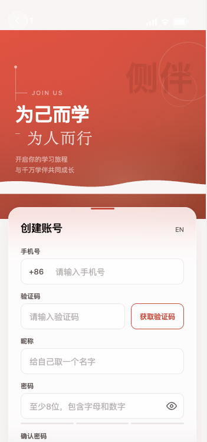
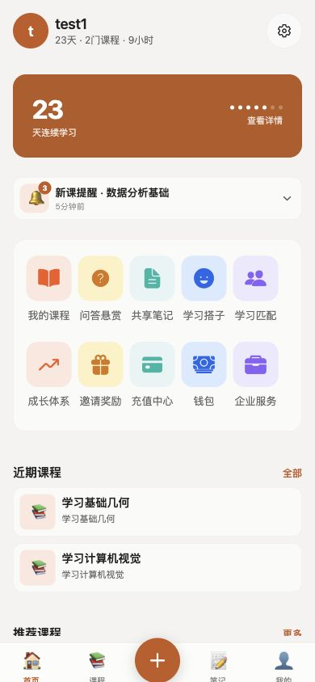

#### 5.3.2 我的课程

对应功能模块：3.3 课程管理模块。

**界面说明**：课程管理页面展示用户创建的所有课程，支持多维度筛选和排序。界面结构如下：

1. **页面标题栏**：顶部左侧"返回"按钮（箭头图标），中间标题"我的课程"，右侧"搜索"按钮（放大镜图标），用于快速查找课程。

2. **状态筛选栏**：4个胶囊按钮水平排列，实时统计各状态课程数量：
   - 全部（77）：显示所有课程
   - 学习中（30）：显示正在进行学习的课程
   - 已完成（26）：显示已学完的课程
   - 未开始（21）：显示尚未开始学习的课程

3. **工具栏**：左侧显示"共 77 门课程"统计文本，中间视图切换按钮（列表视图/网格视图图标），右侧"排序"按钮（默认"最近更新"，可切换排序方式）。

4. **课程网格列表**：以2列网格布局展示课程卡片，每个卡片包含：
   - 课程图标（emoji表情符号，如📊、💻、📈、🧮、🎨）
   - 课程名称（如"学习数据模型决策"、"学习几何基础知识"）
   - 类别标签（如"人工智能"、"设计基础"、"数据科学"、"商业分析"）
   - 进度百分比（如"56%"、"24%"）
   - 状态徽章（学习中/已完成/未开始，不同颜色区分）

5. **底部Tab导航栏**：首页、课程、创建新课程、笔记、我的，当前选中"课程"Tab。

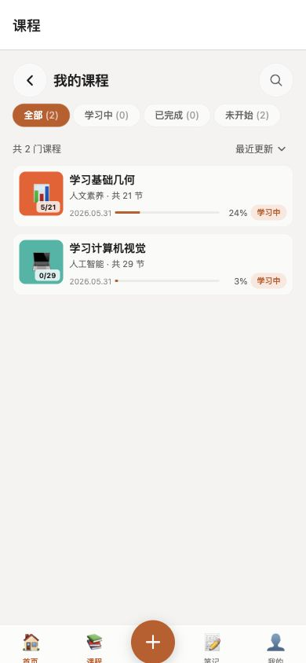

#### 5.3.3 课程详情

对应功能模块：3.6 课程详情模块。

**界面说明**：课程详情页面展示单个课程的完整信息和学习目录，用户可从此页面开始学习或查看课程进度。界面包含：

1. **课程信息头部**：展示课程名称、副标题（可选）、讲师信息、学生数量、评分（五星制）和课程元数据（如创建时间、更新时间）。

2. **统计卡片网格**：3张卡片横向排列，展示课程核心数据：
   - 场景数量：课程包含的教学场景总数
   - 预计时长：完成课程所需的学习时间
   - 难度级别：入门/进阶/高级

3. **标签展示**：课程关联的知识领域标签，以彩色胶囊形式展示（如"人工智能"、"数据分析"、"Python"等），便于用户快速了解课程主题。

4. **课程描述**：可展开/收起的详细描述文本区域，介绍课程内容、学习目标和适用人群。

5. **场景目录列表**：编号列表展示所有教学场景（如幻灯片、测验、交互讨论、PBL项目），每个场景显示：
   - 已完成场景：绿色勾选图标
   - 当前场景：显示序号，突出显示
   - 未到达场景：灰色锁定图标

6. **底部操作栏**：固定在底部，包含：
   - "继续学习"按钮：跳转到上次学习位置或第一个未完成场景
   - "下载"按钮：导出课程为PDF文档（含课程内容+学习笔记），通过系统分享面板分发

7. **收藏按钮**：课程信息区域的收藏图标，点击切换收藏状态，收藏的课程可在个人中心快速查看

8. **公开/私有开关**：课程所有者可设置课程可见性，公开课程生成分享码供其他用户访问

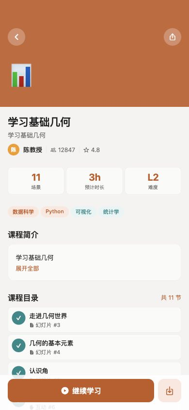

#### 5.3.4 课程播放

对应功能模块：3.5 课程播放模块（核心模块）。

**界面说明**：课程播放是侧伴的核心功能，提供AI驱动的交互式学习体验。界面设计支持多场景类型渲染和丰富的交互操作：

1. **场景内容区**：占据主要屏幕空间，根据场景类型动态渲染：
   - **幻灯片场景**：显示教学内容，包含标题、正文、图片、图表、公式（LaTeX渲染）、代码块等元素，支持聚光灯高亮和激光笔效果
   - **测验场景**：题目卡片展示，选项按钮交互，即时反馈正确/错误状态
   - **交互场景**：讨论主题展示，显示关键讨论点和参与入口
   - **PBL场景**：项目学习步骤列表，支持请求Agent指导

2. **播放控制栏**：底部固定控制区域，包含：
   - 上一个/下一个场景切换按钮
   - 播放/暂停语音按钮
   - 自动播放模式开关
   - 语速调节滑块（0.5x-2.0x）

3. **Agent头像栏**：顶部显示课程配置的智能体角色（教师、助教、学生），点击"提问"按钮进入对话模式。

4. **场景缩略图导航**：可展开的水平缩略图条，显示所有场景预览，点击可快速跳转。

5. **手势提示覆盖层**：首次使用时显示，引导用户了解左右滑动切换场景、双指缩放调整画面等手势操作。

6. **Agent对话界面**：
   - 单Agent聊天：与指定角色一对一问答，输入框支持文字提问
   - 多Agent讨论：触发所有Agent围绕话题讨论，SSE流式实时输出各角色发言

7. **白板覆盖层**：Agent执行绘制操作时自动展开，显示文字、图形、表格、代码块等绘制内容，可手动关闭。

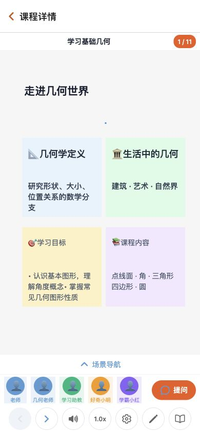
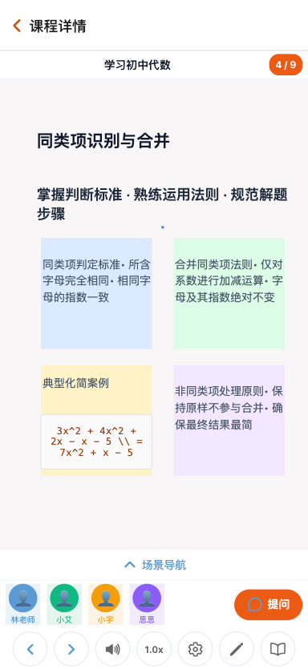
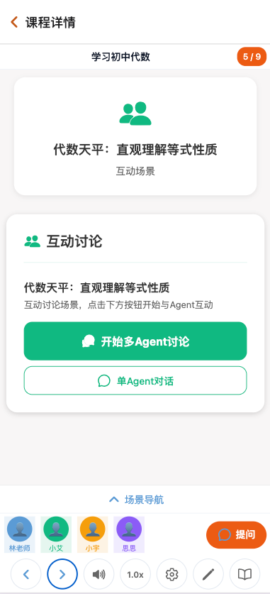
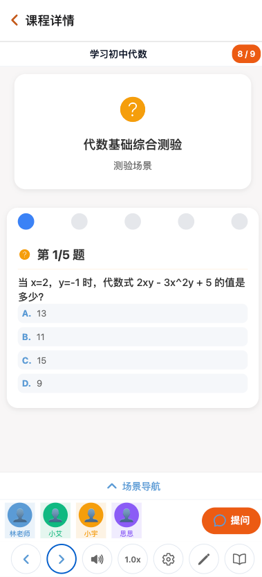
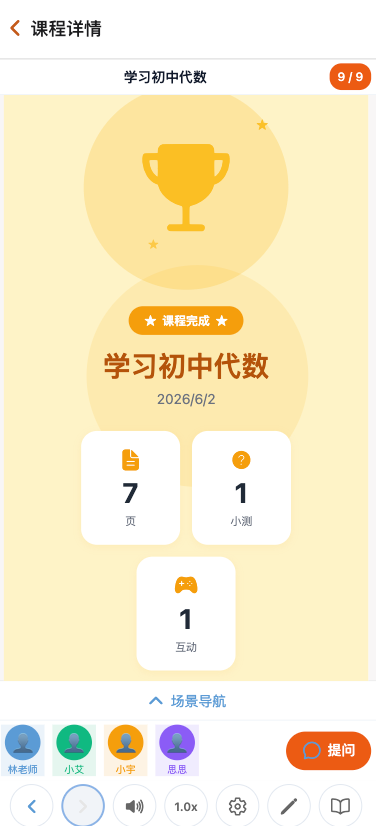

#### 5.3.5 课程创建

对应功能模块：3.4 课程创建模块。

**界面说明**：课程创建采用4步骤向导流程，集成AI生成大纲和智能体配置功能：

**步骤一·需求输入**：
1. 课程主题输入框：用户输入想要学习的主题或需求描述
2. 语言选择：下拉菜单选择授课语言（中文/英文）
3. 网络搜索增强：开关选项，启用后AI可搜索网络补充课程内容
4. "生成大纲"按钮：提交需求后进入下一步

**步骤二·大纲生成**：
1. AI流式生成进度指示器：显示"正在生成课程大纲..."
2. 大纲项列表：实时展示生成的大纲条目，每项包含：
   - 场景类型标签（幻灯片/测验/交互/PBL）
   - 场景标题
   - 内容描述
   - 关键知识点
3. "确认大纲"按钮：生成完成后进入下一步

**步骤三·智能体生成**：
1. AI自动生成教师、助教、学生三种Agent配置
2. 每个Agent配置卡片显示：
   - Agent头像（可选择或AI生成）
   - 姓名（如"李老师"、"小助"、"学霸小明")
   - 角色（教师/助教/学生）
   - 人设描述（如"严谨认真的数学教授")
   - 语音配置（选择TTS提供商和角色声音）
3. 启用/禁用开关：用户可选择使用哪些Agent
4. "确认智能体"按钮：进入最后一步

**步骤四·确认创建**：
1. 课程信息汇总卡片：
   - 课程名称
   - 授课语言
   - 场景数量
   - 启用的Agent列表
2. "创建课程"按钮：一键创建完整课程
3. 后台场景生成进度条：创建后异步生成各场景内容

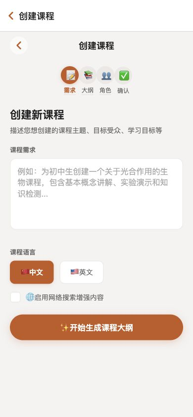

#### 5.3.6 问答悬赏

对应功能模块：3.8 问答悬赏模块。

**界面说明**：问答悬赏是一个知识问答社区，用户可发布问题并设置积分奖励，回答者可获得悬赏积分。界面结构：

1. **页面标题栏**：顶部标题"问答悬赏"，右侧可能有筛选或排序按钮。

2. **排序栏**：水平排列的排序选项：
   - 最新：按发布时间排序
   - 高悬赏：按积分奖励数量排序
   - 待回答：只显示尚无回答的问题

3. **问题列表**：垂直列表展示问题卡片，每张卡片包含：
   - 问题标题：粗体显示，概括问题内容
   - 悬赏积分徽章：钻石图标+积分数量（如"50积分"）
   - 内容预览：问题描述的前几行文字
   - 统计信息：回答数、浏览数
   - 发布时间：相对时间显示（如"3小时前"、"2天前"）

4. **发布按钮**：右下角浮动圆形按钮（➕图标），点击弹出发布问题表单：
   - 问题标题输入框
   - 问题详情输入框（支持富文本）
   - 悬赏积分选择滑块或输入框
   - "发布"按钮

5. **下拉刷新**：支持下拉手势刷新问题列表，获取最新发布的问答。

6. **列表动画**：问题卡片入场时带有淡入或滑动动画效果，提升用户体验。

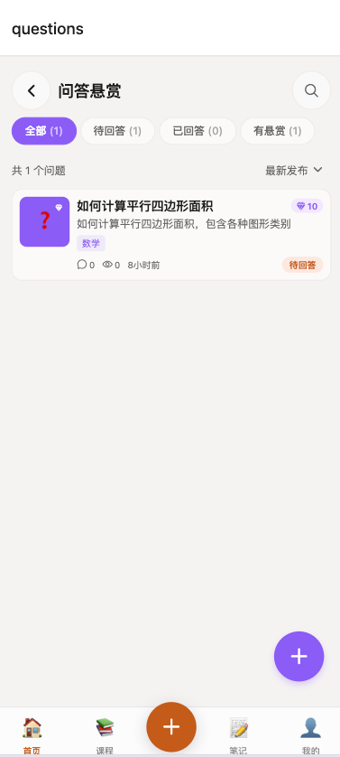

#### 5.3.7 支付充值

对应功能模块：3.15 支付充值模块。

**界面说明**：支付充值页面提供Token虚拟货币的购买渠道，支持多种套餐选择和支付方式。界面包含：

1. **页面标题栏**：顶部标题"充值中心"，左侧返回按钮。

2. **Token说明区**：简要介绍Token用途，如"用于解锁高级课程、兑换积分奖励"等。

3. **套餐选择区**：垂直排列的可点击套餐卡片，每张包含：
   - 套餐名称（如"入门套餐"、"标准套餐"、"高级套餐"、"至尊套餐")
   - Token数量（如"100 Token"、"500 Token"、"1000 Token"、"5000 Token")
   - 价格（以人民币显示，如"¥10"、"¥50"、"¥100"、"¥500")
   - 额外奖励（可选，如"赠送50 Token"、"赠送10%")
   - 套餐描述（如"适合新手尝试"、"最受欢迎选择"）
   - 当前选中状态（高亮边框或颜色区分）

4. **支付方式选择**：点击套餐后弹出支付方式对话框：
   - 微信支付：显示微信图标和选项按钮
   - 支付宝：显示支付宝图标和选项按钮
   - 模拟支付（测试环境）：用于开发测试的模拟支付选项

5. **订单历史入口**：底部或侧边"查看订单历史"链接，点击进入历史订单列表页面。

6. **订单历史列表**：展示历史订单记录，每条包含：
   - Token数量
   - 状态徽章（已完成/待支付/已取消）
   - 支付方式图标
   - 订单日期
   - 订单金额

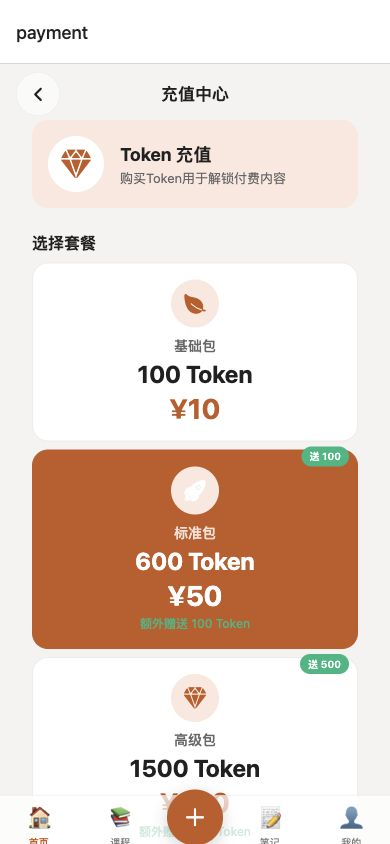

#### 5.3.8 企业服务

对应功能模块：3.18 企业版模块。

**界面说明**：企业服务页面支持企业账户创建、成员管理和团队学习统计。根据企业状态显示不同内容：

**未创建企业时**：
1. 企业创建入口卡片：标题"创建企业账户"
2. 创建表单：
   - 企业名称输入框
   - 所属行业下拉选择（如"教育培训"、"科技互联网"、"金融投资"等）
   - 企业规模选择（小型/中型/大型）
   - "创建企业"按钮

**已创建企业后（企业管理面板）**：
1. **企业信息头部**：展示企业名称、当前订阅计划类型（如"基础版"/"专业版"/"企业版")、管理员角色标识。

2. **邀请成员区**（仅管理员可见）：
   - 批量邀请输入框：输入多个邮箱地址（逗号分隔）
   - "发送邀请"按钮：批量发送邀请邮件

3. **团队统计卡片网格**：4张卡片展示团队学习数据：
   - 成员数量：企业总人数
   - 活跃成员：本周活跃学习人数
   - 课程完成数：团队累计完成课程数
   - 学习总时长：团队累计学习时间（小时）

4. **成员列表**：展示企业成员信息，每条包含：
   - 成员头像和昵称
   - 邮箱地址
   - 角色（管理员/普通成员）
   - 加入时间

5. **成员操作**：管理员可对成员进行移除、修改角色等操作。

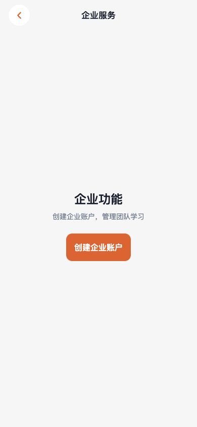

#### 5.3.9 知识管理

对应功能模块：3.9 知识管理模块。

**界面说明**：知识管理页面是AI驱动的知识卡片系统，用户可创建、复习、关联知识卡片，跟踪掌握程度。界面结构：

1. **统计概览横幅**：顶部展示三项核心统计：
   - 知识卡片总数
   - 平均掌握度（百分比或等级）
   - 总复习次数

2. **技能类别进度**：水平进度条展示各技能领域的掌握情况（如编程、数据分析、商业、语言、数学、科学等）。

3. **类别筛选栏**：7个图标按钮水平滚动排列：
   - 全部：显示所有知识卡片
   - 编程：显示编程相关卡片
   - 数据：显示数据分析卡片
   - 商业：显示商业知识卡片
   - 语言：显示语言学习卡片
   - 数学：显示数学知识卡片
   - 科学：显示科学知识卡片

4. **搜索按钮**：右上角搜索图标，点击弹出搜索模态框，支持关键词和类别组合搜索。

5. **创建卡片按钮**：右下角浮动按钮，点击弹出创建表单：
   - 标题输入框
   - 内容输入框（支持富文本）
   - 技能类别下拉选择
   - AI自动生成摘要和关键知识点
   - "保存"按钮

6. **知识卡片列表**：垂直列表展示卡片，每张包含：
   - 卡片标题
   - 掌握级别徽章（Lv.1-5，不同颜色）
   - 内容摘要
   - 技能类别标签
   - 复习次数统计
   - 关键要点预览

7. **卡片详情页**：点击卡片进入详情，包含：
   - 完整知识内容渲染
   - 复习操作：提升/下降掌握度
   - 编辑/删除按钮
   - 关联管理：创建与其他知识卡片的前置/相关/延伸关系

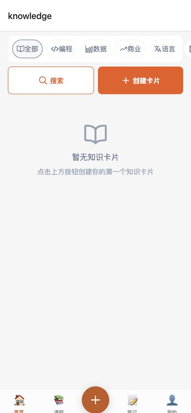

#### 5.3.10 游戏化激励

对应功能模块：3.13 游戏化激励模块。

**界面说明**：游戏化激励页面是完整的学习激励体系，包含联赛、每日任务、连续打卡和成就里程碑，通过游戏化设计激励用户持续学习。界面分区：

1. **动机卡片**：顶部展示个性化激励消息，如"坚持学习，成为更好的自己"，配合动画效果鼓励用户。

2. **联赛系统卡片**：彩色主题卡片（颜色随联赛级别变化），展示：
   - 联赛图标和级别名称（如"青铜联赛"、"白银联赛"、"黄金联赛")
   - 当前积分数值
   - 晋升进度条：显示距离下一级别所需积分
   - 服务器排名位置

3. **连续打卡奖励区**：
   - 当前连续天数大号显示（如"23天")
   - 今日可获积分提示
   - 明日奖励预览
   - 7天奖励网格：展示每日打卡奖励，已完成天数显示勾选，未完成显示积分奖励预览

4. **成就里程碑区**：
   - 待解锁里程碑卡片列表，每张包含：
     - 成就图标
     - 成就名称（如"初学者"、"学霸"、"知识达人")
     - 连续天数目标（如"连续学习7天")
     - 稀有度边框颜色（普通/稀有/史诗/传说）
   - 脉冲动画：吸引用户注意待解锁成就
   - "检查解锁"按钮：手动检查是否达成里程碑条件

5. **每日任务系统**：
   - 任务卡片列表，每个任务包含：
     - 任务图标（如📚学习、📝笔记、💬讨论）
     - 任务名称和描述
     - 进度条：当前值/目标值（如"3/5课程")
     - 奖励积分数量
   - 完成状态：已完成任务显示完成徽章和勾选图标
   - 完成庆祝动画：任务完成时弹出庆祝效果和奖励展示

6. **下拉刷新**：支持刷新所有游戏化数据，获取最新任务进度和成就状态。

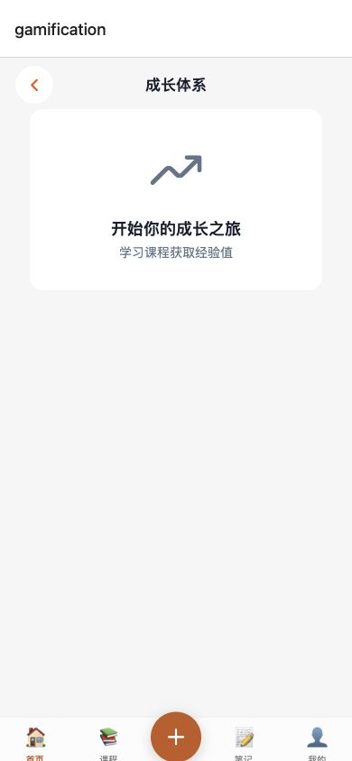

#### 5.3.11 邀请系统

对应功能模块：3.14 邀请系统模块。

**界面说明**：邀请系统页面支持邀请码分享和多层级奖励跟踪，激励用户通过社交传播扩大用户群体。界面包含：

1. **邀请码展示区**：
   - 大号格式化邀请码显示（如"CEBAN-XXXXX"）
   - 复制按钮：一键复制邀请码到剪贴板
   - "分享邀请码"按钮：调用系统分享对话框，支持微信、短信、邮件等渠道分享

2. **邀请统计网格**：5项统计数据卡片排列：
   - 总邀请数：累计邀请人数
   - 一级邀请：直接邀请人数
   - 二级邀请：间接邀请人数（被邀请人再次邀请）
   - 获得积分：通过邀请获得的积分总数
   - 获得Token：通过邀请获得的Token总数

3. **奖励规则说明卡片**：三级奖励体系详解：
   - 一级奖励：邀请人获得20积分+50Token
   - 二级奖励：间接邀请人获得10积分
   - 三级奖励：三级邀请人获得5积分
   - 新用户奖励：被邀请人获得100Token注册奖励
   - 各级奖励以图标和文字清晰展示

4. **输入邀请码区**：
   - 底部"使用邀请码"按钮
   - 点击弹出提示对话框：
     - 邀请码输入框
     - "确认使用"按钮
     - 仅限未使用过邀请码的新用户

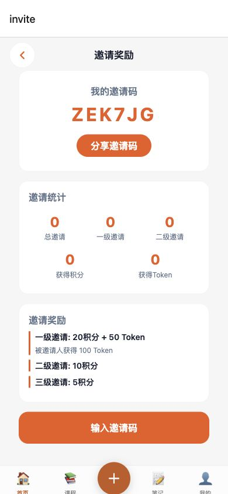

#### 5.3.12 钱包

对应功能模块：3.16 钱包模块。

**界面说明**：钱包页面管理用户的数字资产，展示Token和积分余额及交易流水记录。界面结构：

1. **页面标题栏**：顶部标题"钱包"，左侧返回按钮。

2. **余额展示区**：双栏卡片展示两种数字资产：
   - **Token余额**：左侧卡片，大号数字显示当前Token数量（如"1500"），下方可能显示充值入口链接
   - **积分余额**：右侧卡片，大号数字显示当前积分数量（如"350"），下方可能显示积分用途说明

3. **交易记录区**：Tab切换查看不同类型交易：
   - Token交易：显示Token收支记录
   - 积分记录：显示积分收支记录

4. **交易列表**：垂直列表展示交易记录，每条包含：
   - 交易类型图标（如充值图标、消费图标、奖励图标）
   - 交易描述（如"充值1000Token"、"完成课程奖励"、"悬赏问答收入")
   - 交易日期（如"2026-06-01")
   - 金额数值（正数绿色显示收入，负数红色显示支出）

5. **下拉刷新**：支持下拉手势刷新余额和交易数据，获取最新资产状态。

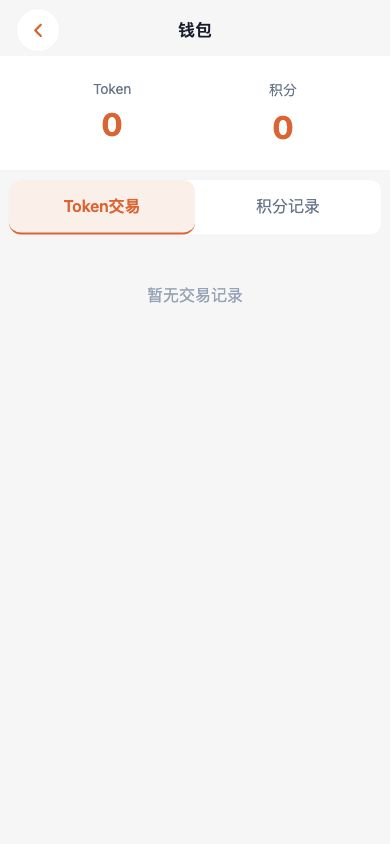

#### 5.3.13 个人中心

对应功能模块：3.17 个人中心模块。

**界面说明**：个人中心页面展示用户资料、学习统计、成就展示和系统设置，是用户管理账户和个性化配置的入口。界面分区：

1. **个人资料头部**：
   - 用户头像（圆形，可点击编辑）
   - 昵称显示
   - 个人简介（可选）
   - 等级徽章：显示级别数字和称号（如"Lv.5 学霸"）

2. **核心统计卡片网格**：3张卡片展示学习数据：
   - 连续天数：当前连续学习天数
   - 全部课程：用户自己创建的课程数量
   - 学习时长：累计学习时间（小时）

3. **本周学习图表**：
   - 每日学习时长柱状图：7天的学习时长可视化
   - 显示本周学习分布情况
   - 底部显示本周总计时长

4. **成就徽章区**：
   - 水平滚动的成就图标列表
   - 已解锁成就：完整彩色图标
   - 未解锁成就：灰色或半透明图标
   - 点击可查看成就详情

5. **设置菜单列表**：6项设置入口垂直排列：
   - 编辑个人资料：修改头像、昵称、简介
   - 通知设置：管理推送通知偏好
   - 学习偏好：设置学习提醒时间、每日目标等
   - 深色模式：切换界面主题（明亮/暗黑）
   - 帮助与反馈：联系客服、提交反馈
   - 退出登录：清除凭据返回登录页

6. **语言切换**：点击后弹出语言选择模态框，支持：
   - 中文
   - 英文
   - 其他语言（根据配置）

7. **底部Tab导航栏**：首页、课程、创建新课程、笔记、我的，当前选中"我的"Tab。

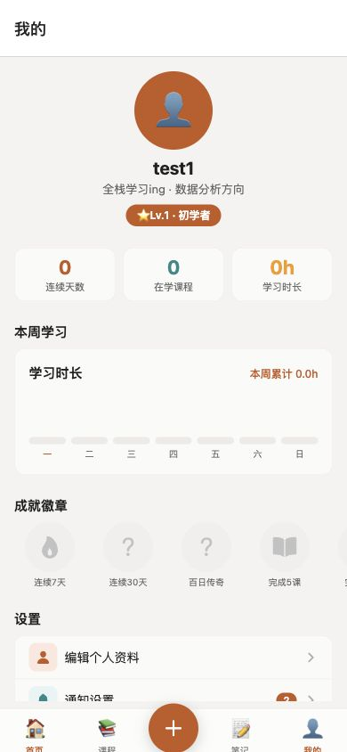

#### 5.3.14 笔记管理

对应功能模块：3.10 笔记管理模块。

**界面说明**：笔记管理页面展示用户的个人学习笔记，支持搜索、筛选和收藏操作。界面结构：

1. **笔记统计横幅**：顶部显示笔记总数和今日新增笔记数。

2. **搜索与筛选栏**：内联搜索栏支持关键词搜索，水平滚动标签筛选（全部/数据分析/Python/UI设计/收藏等），快速定位目标笔记。

3. **时间分组列表**：笔记按"今天"和"本周"分组展示，每条包含图标缩略图、标题、内容预览、类别标签、时间戳和收藏星标。

4. **收藏功能**：一键切换笔记收藏状态，收藏的笔记可快速筛选查看。

5. **笔记详情**：富文本内容渲染，支持文本段落、代码块（深色背景高亮）和高亮块，展示标签和相关笔记，提供下载和分享操作。

6. **创建笔记**：右下角浮动按钮快速创建新笔记，支持课堂中即时记录。

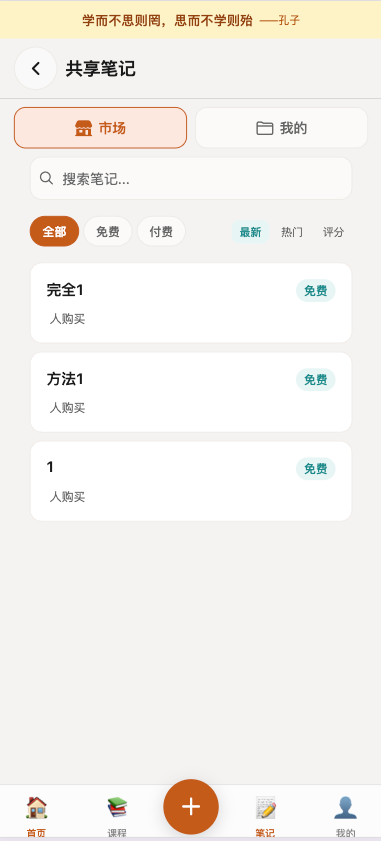

#### 5.3.15 学习搭子

对应功能模块：3.11 学习搭子模块。

**界面说明**：学习搭子页面管理AI伴学角色，提供学习消息推送和情绪鼓励。界面包含：

1. **搭子配置区**：展示当前搭子名称、类型和语气风格，支持从多种搭子类型中选择切换。

2. **搭子类型选择列表**：展示可选搭子类型（名称+描述），点击选择后自动更新配置。

3. **搭子消息列表**：展示搭子推送的学习消息，未读消息蓝色高亮，消息由系统事件触发（如学习完成、断签提醒等）。

#### 5.3.16 学习匹配

对应功能模块：3.12 学习匹配模块。

**界面说明**：学习匹配页面基于学习目标和兴趣推荐学习伙伴。界面包含：

1. **匹配偏好设置**：展示当前偏好（进度等级、目标标签），提供"设置"按钮修改偏好和"搜索匹配"按钮发起匹配。

2. **待处理匹配**：展示未接受的匹配推荐，包含用户昵称、匹配分数、共同标签、过期时间，提供接受/拒绝操作。

3. **学习伙伴列表**：展示已接受的学习伙伴，包含昵称和共同标签。

4. **偏好设置模态框**：输入目标标签、选择进度等级（初级/中级/高级）、保存偏好。

---

## 六、安装与卸载

### 6.1 安装

1. 通过 App Store（iOS）或应用商店（Android）搜索"侧伴"下载安装
2. 安装完成后点击应用图标启动
3. 首次使用需注册账户并同意隐私政策

### 6.2 卸载

1. iOS：长按应用图标 → 移除 App
2. Android：设置 → 应用 → 侧伴 → 卸载

### 6.3 数据清除

- 卸载应用将清除所有本地缓存数据
- 云端数据保留在服务器，重新登录可恢复

---

**著作权人：南京帕兰数字科技有限公司**

**日期：2026年6月**
