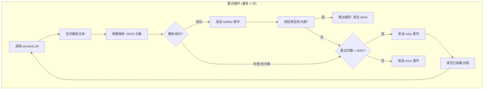
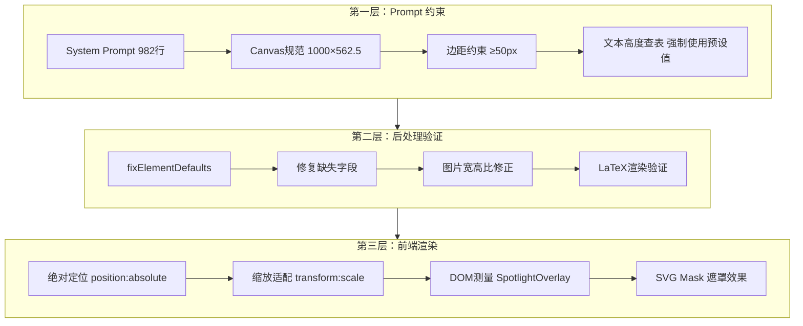

# 课程生成流程详细梳理

## 页面入口

`http://localhost:3031/generation-preview`

## 整体流程图

```mermaid
flowchart TB
    subgraph Step0["步骤 0: 初始化"]
        A[从 sessionStorage 加载 GenerationSessionState] --> B[创建 AbortController 用于取消请求]
        B --> C[解析活动步骤 getActiveSteps]
    end

    subgraph Step1["步骤 1: PDF 解析 (可选)"]
        D{有 PDF?} -->|是| E[调用 /api/parse-pdf]
        E --> F[提取 PDF 文本和图片]
        F --> G[截断文本到 MAX_PDF_CONTENT_CHARS]
        G --> H[存储图片到 IndexedDB]
        H --> I[更新 session 状态]
        D -->|否| J[跳过此步骤]
    end

    subgraph Step2["步骤 2: Web Search (可选)"]
        K{启用 Web Search?} -->|是| L[调用 /api/web-search]
        L --> M[获取研究上下文 researchContext]
        M --> N[记录搜索来源 sources]
        K -->|否| O[跳过此步骤]
    end

    subgraph Step3["步骤 3: Agent 生成 (可选)"]
        P{agentMode = auto?} -->|是| Q[调用 /api/generate/agent-profiles]
        Q --> R[LLM 生成智能体配置]
        R --> S[保存到 IndexedDB AgentRegistry]
        S --> T[显示 AgentRevealModal 卡片揭示动画]
        T --> U[用户确认后继续]
        P -->|否| V[使用预设智能体]
    end

    subgraph Step4["步骤 4: 大纲生成 (SSE 流式)"]
        W[调用 /api/generate/scene-outlines-stream] --> X[SSE 流式接收大纲]
        X --> Y[逐个显示 SceneOutline]
        Y --> Z[完成后存储到 session]
    end

    subgraph Step5["步骤 5: 场景内容生成"]
        AA[创建 Stage 对象] --> AB[存储到 useStageStore]
        AB --> AC[仅生成第一个场景的内容]
        AC --> AD[调用 /api/generate/scene-content]
        AD --> AE[返回 slide/quiz/interactive/pbl 内容]
    end

    subgraph Step6["步骤 6: 动作生成"]
        AF[调用 /api/generate/scene-actions] --> AG[生成 speech/spotlight/whiteboard 等动作]
        AG --> AH[返回完整 Scene 对象]
    end

    subgraph Step7["步骤 7: TTS 生成 (可选)"]
        AI{启用 TTS?} -->|是| AJ[调用 /api/generate/tts]
        AJ --> AK[为每个 speech 动作生成音频]
        AK --> AL[存储音频到 IndexedDB]
        AI -->|否| AM[跳过此步骤]
    end

    subgraph Step8["步骤 8: 保存与跳转"]
        AN[添加 Scene 到 store] --> AO[设置剩余大纲为骨架占位符]
        AO --> AP[保存 generationParams 到 sessionStorage]
        AP --> AQ[保存 store 到 IndexedDB]
        AQ --> AR[跳转到 /classroom/{stageId}]
    end

    Step0 --> Step1
    Step1 --> Step2
    Step2 --> Step3
    Step3 --> Step4
    Step4 --> Step5
    Step5 --> Step6
    Step6 --> Step7
    Step7 --> Step8
```

---

## 详细步骤说明

### 步骤 0: 初始化

**触发条件**: 页面加载时自动执行

**核心逻辑**:
- 从 `sessionStorage` 加载 `GenerationSessionState`（由首页传递）
- 创建 `AbortController` 用于取消请求（支持页面离开时中断）
- 根据 session 配置解析活动步骤 `getActiveSteps`

**关键文件**:
| 文件 | 行号 | 功能 |
|------|------|------|
| `app/generation-preview/page.tsx` | 69-83 | 从 sessionStorage 加载 session |
| `app/generation-preview/page.tsx` | 130-145 | 创建 AbortController |
| `app/generation-preview/types.ts` | 83-90 | getActiveSteps 步骤过滤逻辑 |

**Session 数据结构** (`GenerationSessionState`):
```typescript
interface GenerationSessionState {
  sessionId: string;
  requirements: UserRequirements;  // 用户需求文本、语言设置
  pdfText: string;                 // PDF 解析后的文本内容
  pdfImages?: PdfImage[];          // PDF 提取的图片列表
  imageStorageIds?: string[];      // IndexedDB 图片存储 ID
  sceneOutlines?: SceneOutline[];  // 场景大纲数组
  researchContext?: string;        // Web Search 研究上下文
  researchSources?: Array<{ title: string; url: string }>; // 搜索来源
}
```

---

### 步骤 1: PDF 解析 (可选)

**触发条件**: `session.pdfStorageKey` 存在且 `session.pdfText` 为空

**核心逻辑**:
1. 从 IndexedDB 加载 PDF Blob
2. 调用 `/api/parse-pdf` 解析 PDF
3. 提取文本和图片
4. 截断文本到 `MAX_PDF_CONTENT_CHARS` (防止超出 LLM token 限制)
5. 存储图片到 IndexedDB，获取 `imageStorageIds`
6. 更新 session 状态

**关键文件**:
| 文件 | 行号 | 功能 |
|------|------|------|
| `app/generation-preview/page.tsx` | 158-299 | 前端 PDF 解析流程 |
| `app/api/parse-pdf/route.ts` | - | 后端 PDF 解析 API |

**API 详情**:
```
POST /api/parse-pdf
Content-Type: multipart/form-data

输入:
  - pdf: PDF 文件 Blob
  - providerId: PDF 解析 Provider ID
  - apiKey: Provider API Key
  - baseUrl: Provider Base URL

输出:
  {
    success: true,
    data: {
      text: string,           // PDF 文本内容
      images: string[],       // 图片 URL 数组（旧格式）
      metadata: {
        pdfImages: [{         // 图片元数据（新格式）
          id: string,
          src?: string,
          pageNumber: number,
          description?: string,
          width?: number,
          height?: number
        }]
      }
    }
  }
```

**截断限制**:
- `MAX_PDF_CONTENT_CHARS`: 文本最大字符数
- `MAX_VISION_IMAGES`: Vision 模型可处理的最大图片数

---

### 步骤 2: Web Search (可选)

**触发条件**: `session.requirements.webSearch` 为 true

**核心逻辑**:
1. 从设置中获取 Web Search Provider 配置
2. 调用 `/api/web-search` 进行搜索
3. 获取研究上下文 `researchContext` 和来源列表
4. 更新 session 状态

**关键文件**:
| 文件 | 行号 | 功能 |
|------|------|------|
| `app/generation-preview/page.tsx` | 301-365 | 前端 Web Search 流程 |
| `app/api/web-search/route.ts` | - | 后端 Web Search API |
| `lib/web-search/tavily.ts` | - | Tavily 搜索实现 |

**API 详情**:
```
POST /api/web-search
Content-Type: application/json

输入:
  {
    query: string,        // 搜索查询（用户需求）
    pdfText?: string,     // PDF 文本上下文
    apiKey?: string       // Tavily API Key
  }

输出:
  {
    answer: string,       // AI 总结答案
    sources: [{           // 搜索来源
      title: string,
      url: string
    }],
    context: string       // 格式化的研究上下文
  }
```

---

### 步骤 3: Agent 生成 (可选)

**触发条件**: `settings.agentMode === 'auto'`

**核心逻辑**:
1. 准备可用头像和语音列表
2. 调用 `/api/generate/agent-profiles` 生成智能体配置
3. 保存到 IndexedDB `AgentRegistry`
4. 显示 `AgentRevealModal` 卡片揭示动画
5. 用户确认后继续

**关键文件**:
| 文件 | 行号 | 功能 |
|------|------|------|
| `app/generation-preview/page.tsx` | 380-572 | 前端 Agent 生成流程 |
| `app/api/generate/agent-profiles/route.ts` | - | 后端 Agent 生成 API |
| `lib/orchestration/registry/store.ts` | - | Agent 注册表存储 |

**API 详情**:
```
POST /api/generate/agent-profiles
Content-Type: application/json

输入:
  {
    stageInfo: {
      name: string,       // 课程主题
      description: string // 课程描述
    },
    language: string,     // 语言 (zh-CN/en-US)
    availableAvatars: string[],  // 可用头像路径列表
    avatarDescriptions: [{       // 头像描述
      path: string,
      desc: string
    }],
    availableVoices: [{          // 可用语音列表
      providerId: string,
      voiceId: string,
      voiceName: string
    }]
  }

输出:
  {
    success: true,
    agents: [{
      id: string,
      name: string,
      role: 'teacher' | 'assistant' | 'student',
      persona: string,      // 人设描述
      avatar: string,       // 头像路径
      color: string,        // 显示颜色
      priority: number,     // 显示优先级
      voiceConfig?: {       // 语音配置
        providerId: string,
        voiceId: string
      }
    }]
  }
```

---

### 步骤 4: 大纲生成 (SSE 流式)

**触发条件**: 必选步骤（`session.sceneOutlines` 为空时执行）

**核心逻辑**:
1. 构建 API Headers（包含模型配置）
2. 调用 `/api/generate/scene-outlines-stream` SSE API
3. 流式接收大纲对象，逐个显示
4. 完成后存储到 session

**关键文件**:
| 文件 | 行号 | 功能 |
|------|------|------|
| `app/generation-preview/page.tsx` | 574-693 | 前端 SSE 处理 |
| `app/api/generate/scene-outlines-stream/route.ts` | - | 后端 SSE API |
| `lib/generation/outline-generator.ts` | - | 大纲生成逻辑 |
| `lib/generation/prompts.ts` | - | 提示词模板 |

**API 详情**:
```
POST /api/generate/scene-outlines-stream
Content-Type: application/json

输入:
  {
    requirements: {
      requirement: string,   // 用户需求
      language: string       // 语言
    },
    pdfText?: string,        // PDF 文本
    pdfImages?: PdfImage[],  // PDF 图片
    imageMapping?: {         // 图片 URL 映射
      [id]: string
    },
    researchContext?: string, // Web Search 上下文
    agents?: AgentInfo[]     // 智能体信息
  }

Headers:
  x-model: string           // 模型标识
  x-api-key: string         // API Key
  x-base-url: string        // API Base URL
  x-image-generation-enabled: string // 图片生成开关
  x-video-generation-enabled: string // 视频生成开关

输出 (SSE 事件流):
  data: { type: 'outline', data: SceneOutline, index: number }
  data: { type: 'retry', attempt: number, maxAttempts: number }
  data: { type: 'done', outlines: SceneOutline[] }
  data: { type: 'error', error: string }
```

**大纲类型** (`SceneOutline.type`):
| 类型 | 说明 | 特殊配置 |
|------|------|----------|
| `slide` | 幻灯片 | 无 |
| `quiz` | 测验 | `quizConfig: { questions: QuizQuestion[] }` |
| `interactive` | 交互式场景 | `interactiveConfig: { htmlTemplate: string }` |
| `pbl` | 项目制学习 | `pblConfig: { scenario: string, tasks: string[] }` |

**大纲数据结构**:
```typescript
interface SceneOutline {
  id: string;
  type: 'slide' | 'quiz' | 'interactive' | 'pbl';
  title: string;
  description: string;
  key_points: string[];
  order: number;
  language?: string;
  quizConfig?: QuizConfig;
  interactiveConfig?: InteractiveConfig;
  pblConfig?: PBLConfig;
  mediaGenerations?: MediaGeneration[];  // AI 媒体生成请求
}
```

#### SSE 错误重试机制

大纲生成 SSE API 内置了完善的错误重试机制，确保在 LLM 响应异常时能够自动恢复。

**重试机制流程图**:



**关键参数**:

| 参数 | 值 | 文件位置 | 说明 |
|------|-----|----------|------|
| `MAX_STREAM_RETRIES` | 2 | route.ts:225 | 最大重试次数 |
| `HEARTBEAT_INTERVAL_MS` | 15000 | route.ts:203 | 心跳间隔（防连接超时）|
| 总尝试次数 | 3 | route.ts:252 | 首次 + 2次重试 |

**触发重试的条件**:

1. **空响应重试** (route.ts:282-301)

触发场景：
- LLM 返回空字符串
- LLM 返回非 JSON 格式内容（如解释性文本）
- LLM 返回 JSON 但不是数组格式
- LLM 返回 JSON 数组但无法解析为 `SceneOutline`

```typescript
// 流结束，parsedOutlines 为空时触发重试
if (parsedOutlines.length > 0) break;  // 有大纲，跳出循环

// 空结果 — 设置错误信息
lastError = fullText.trim()
  ? 'LLM response could not be parsed into outlines'  // 有文本但无法解析
  : 'LLM returned empty response';                     // 完全空响应
```

2. **流异常重试** (route.ts:302-318)

触发场景：
- LLM API 连接失败
- LLM API 超时
- 网络/代理错误
- LLM 服务内部错误

```typescript
} catch (error) {
  lastError = error instanceof Error ? error.message : String(error);
  if (attempt <= MAX_STREAM_RETRIES) {
    log.warn(`Stream error, retrying...`);
    // 发送 retry 事件，继续下一次尝试
    continue;
  }
}
```

**SSE 事件类型详解**:

| 事件类型 | 触发时机 | 数据结构 |
|----------|----------|----------|
| `outline` | 每解析出一个大纲对象 | `{ type: 'outline', data: SceneOutline, index: number }` |
| `retry` | 重试开始前 | `{ type: 'retry', attempt: number, maxAttempts: number }` |
| `done` | 成功完成 | `{ type: 'done', outlines: SceneOutline[] }` |
| `error` | 重试耗尽后失败 | `{ type: 'error', error: string }` |
| `:heartbeat` | 每 15 秒 | SSE 注释（不作为事件处理）|

**增量 JSON 解析器**:

核心算法 `extractNewOutlines` (route.ts:45-97) 实现了实时解析流式文本：

```typescript
function extractNewOutlines(buffer: string, alreadyParsed: number): SceneOutline[] {
  // 1. 跳过 markdown fencing (如 ```json)
  const stripped = buffer.replace(/^[\s\S]*?(?=\[)/, '');
  const arrayStart = stripped.indexOf('[');
  
  // 2. 状态机逐字符解析
  let depth = 0;        // JSON 括号深度
  let objectStart = -1; // 当前对象起始位置
  let inString = false; // 是否在字符串内
  let escaped = false;  // 是否处理转义字符
  let objectCount = 0;  // 已发现对象计数
  
  // 3. 提取完整的 JSON 对象
  for (let i = arrayStart + 1; i < stripped.length; i++) {
    // 状态机处理...
    if (char === '{' && !inString) {
      if (depth === 0) objectStart = i;
      depth++;
    } else if (char === '}' && !inString) {
      depth--;
      if (depth === 0 && objectStart >= 0) {
        objectCount++;
        if (objectCount > alreadyParsed) {
          // 解析新对象
          results.push(JSON.parse(stripped.substring(objectStart, i + 1)));
        }
      }
    }
  }
  return results;
}
```

设计要点：
- **实时解析**: 流式文本到达时立即尝试解析对象
- **增量处理**: 通过 `alreadyParsed` 参数跳过已解析的，避免重复
- **容错性**: 不完整的 JSON 被跳过，不影响后续解析
- **兼容性**: 自动跳过 LLM 可能输出的 markdown fencing

**心跳机制**:

防止 SSE 连接因无数据而被浏览器/代理超时中断：

```typescript
const HEARTBEAT_INTERVAL_MS = 15_000;  // 15 秒

const startHeartbeat = () => {
  heartbeatTimer = setInterval(() => {
    // 发送 SSE 注释（以冒号开头）
    controller.enqueue(encoder.encode(`:heartbeat\n\n`));
  }, HEARTBEAT_INTERVAL_MS);
};
```

SSE 注释格式：以 `:` 开头的行是 SSE 注释，浏览器会忽略但保持连接活跃。

**客户端重试处理** (page.tsx:640-643):

```typescript
if (evt.type === 'retry') {
  collected.length = 0;          // 清空已收集的大纲
  setStreamingOutlines([]);      // 清空 UI 显示
  setStatusMessage(t('generation.outlineRetrying'));  // 显示重试提示
}
```

用户体验：
1. 收到 `retry` 事件时，清空已显示的大纲
2. 显示 "正在重试..." 提示
3. 等待新一轮 `outline` 事件

**关键文件索引**:

| 文件 | 行号 | 功能 |
|------|------|------|
| `app/api/generate/scene-outlines-stream/route.ts` | 225 | `MAX_STREAM_RETRIES` 定义 |
| `app/api/generate/scene-outlines-stream/route.ts` | 252-319 | 重试循环主逻辑 |
| `app/api/generate/scene-outlines-stream/route.ts` | 45-97 | 增量 JSON 解析器 |
| `app/api/generate/scene-outlines-stream/route.ts` | 206-223 | 心跳机制 |
| `app/generation-preview/page.tsx` | 640-643 | 前端 retry 事件处理 |

**潜在改进建议**:

| 问题 | 当前状态 | 建议改进 |
|------|----------|----------|
| **重试间隔** | 无间隔，立即重试 | 添加指数退避（如 2s, 4s）|
| **大纲保留** | 重试时清空所有大纲 | 可考虑保留部分已解析的大纲 |
| **错误分类** | 仅记录错误消息 | 区分网络错误、解析错误、空响应 |
| **用户反馈** | 仅显示 "正在重试" | 可显示具体重试原因 |
| **重试计数** | 仅日志记录 | 可在 UI 显示重试次数 |

---

### 步骤 5: 场景内容生成

**触发条件**: 必选步骤

**核心逻辑**:
1. 创建 `Stage` 对象并存储到 `useStageStore`
2. **仅生成第一个场景的内容**（其余场景在课堂页面按需生成）
3. 调用 `/api/generate/scene-content` 获取场景内容
4. 返回对应类型的内容数据

**关键文件**:
| 文件 | 行号 | 功能 |
|------|------|------|
| `app/generation-preview/page.tsx` | 723-779 | 前端调用 |
| `app/api/generate/scene-content/route.ts` | - | 后端 API |
| `lib/generation/scene-generator.ts` | 362-376 | 内容生成逻辑 |

**API 详情**:
```
POST /api/generate/scene-content
Content-Type: application/json

输入:
  {
    outline: SceneOutline,      // 当前场景大纲
    allOutlines: SceneOutline[], // 所有大纲（用于上下文）
    pdfImages?: PdfImage[],      // PDF 图片
    imageMapping?: ImageMapping, // 图片 URL 映射
    stageInfo: {
      name: string,
      description: string,
      language: string,
      style: string
    },
    stageId: string,             // Stage ID
    agents?: AgentInfo[]         // 智能体信息
  }

输出:
  {
    success: true,
    content: GeneratedSlideContent | GeneratedQuizContent | GeneratedInteractiveContent | GeneratedPBLContent,
    effectiveOutline: SceneOutline  // 实际使用的大纲（可能有类型回退）
  }
```

**内容类型数据结构**:
```typescript
// 幻灯片内容
interface GeneratedSlideContent {
  type: 'slide';
  title: string;
  slide: {
    id: string;
    elements: PPTElement[];    // 幻灯片元素
    theme?: SlideTheme;        // 主题配置
    background?: SlideBackground;
  };
}

// 测验内容
interface GeneratedQuizContent {
  type: 'quiz';
  title: string;
  quiz: {
    questions: QuizQuestion[];
  };
}

// 交互式场景内容
interface GeneratedInteractiveContent {
  type: 'interactive';
  title: string;
  interactive: {
    html: string;              // HTML 模板
    css?: string;
    js?: string;
  };
}

// PBL 内容
interface GeneratedPBLContent {
  type: 'pbl';
  title: string;
  pbl: {
    scenario: string;
    tasks: PBLTask[];
    model?: ScientificModel;
  };
}
```

#### 精确排版机制

**核心原理**: 通过精心设计的 System Prompt 模板，强制 LLM 生成符合严格排版规则的 Canvas 元素。

**Prompt模板位置**: `lib/generation/prompts/templates/slide-content/system.md` (982行)

##### Canvas 规范

```
Dimensions: 1000 × 562.5 (16:9比例)
Margins:
  - Top: ≥ 50
  - Bottom: ≤ 512.5
  - Left: ≥ 50
  - Right: ≤ 950

Alignment Reference Points:
  - Left-aligned: left = 60 or 80
  - Centered: left = (1000 - width) / 2
  - Right-aligned: left = 1000 - width - 60
```

##### 文本高度查表（强制约束）

AI 生成的所有文本元素高度必须从预设表格中选择，禁止估算：

| Font Size | 1 line | 2 lines | 3 lines | 4 lines | 5 lines |
|-----------|--------|---------|---------|---------|---------|
| 14px      | 43     | 64      | 85      | 106     | 127     |
| 16px      | 46     | 70      | 94      | 118     | 142     |
| 18px      | 49     | 76      | 103     | 130     | 157     |
| 20px      | 52     | 82      | 112     | 142     | 172     |
| 24px      | 58     | 94      | 130     | 166     | 202     |
| 28px      | 64     | 106     | 148     | 190     | 232     |
| 32px      | 70     | 118     | 166     | 214     | 262     |
| 36px      | 76     | 130     | 184     | 238     | 292     |

**计算公式**: `height = line_count × (font_size × 1.5) + 20` (包含10px上下padding)

##### 元素类型定义

**TextElement**:
```json
{
  "id": "text_001",
  "type": "text",
  "left": 60,
  "top": 80,
  "width": 880,
  "height": 76,
  "content": "<p style=\"font-size: 24px;\">Title</p>",
  "defaultFontName": "",
  "defaultColor": "#333333"
}
```

**ShapeElement**:
```json
{
  "id": "shape_001",
  "type": "shape",
  "left": 60,
  "top": 200,
  "width": 400,
  "height": 100,
  "path": "M 0 0 L 1 0 L 1 1 L 0 1 Z",
  "viewBox": [1, 1],
  "fill": "#5b9bd5",
  "fixedRatio": false
}
```

**ImageElement**:
```json
{
  "id": "image_001",
  "type": "image",
  "left": 100,
  "top": 150,
  "width": 400,
  "height": 300,
  "src": "img_1",
  "fixedRatio": true
}
```

##### 设计规则

**Rule 1 - 文本宽度计算**:
```
characters_per_line = (width - 20) / font_size
安全利用率: ≤75%
```

**Rule 3 - 元素对齐**:
```
垂直居中: inner.top = outer.top + (outer.height - inner.height) / 2
水平居中: inner.left = outer.left + (outer.width - inner.width) / 2
验证: 中心点差异 < 2px
```

**Rule 5 - 文本与背景形状**:
```json
// 背景形状
{ "left": 60, "top": 150, "width": 400, "height": 120 }

// 文本（居中）
{ "left": 80, "top": 172, "width": 360, "height": 76 }

// 计算验证：
// text.left = 60 + (400 - 360)/2 = 80 ✓
// text.top = 150 + (120 - 76)/2 = 172 ✓
```

**Rule 7 - 间距标准**:
| 间距类型 | 推荐值 |
|----------|--------|
| 标题到副标题 | 30-40px |
| 标题到正文 | 35-50px |
| 段落间距 | 20-30px |
| 多列间距 | 40-60px |
| 元素到边缘 | ≥50px |

##### 后处理流程

**位置**: `lib/generation/scene-generator.ts:539-705`

```typescript
async function generateSlideContent(outline, aiCall, ...) {
  // 1. 构建 prompt
  const prompts = buildPrompt(PROMPT_IDS.SLIDE_CONTENT, {
    title, description, keyPoints, canvas_width, canvas_height
  });

  // 2. 调用 LLM
  const response = await aiCall(prompts.system, prompts.user);

  // 3. 解析 JSON
  const generatedData = parseJsonResponse<GeneratedSlideData>(response);

  // 4. 后处理
  const fixedElements = fixElementDefaults(generatedData.elements);     // 修复缺失字段
  const latexProcessed = processLatexElements(fixedElements);            // LaTeX渲染
  const resolvedElements = resolveImageIds(latexProcessed, imageMapping);// 图片ID解析

  // 5. 分配唯一ID
  const processedElements = resolvedElements.map(el => ({
    ...el,
    id: `${el.type}_${nanoid(8)}`,
    rotate: 0
  }));

  return { elements: processedElements, background };
}
```

##### 接口交互案例

**请求示例**:
```json
POST /api/generate/scene-content
{
  "outline": {
    "id": "outline_001",
    "type": "slide",
    "title": "课程导入：市场营销的本质与价值",
    "description": "辨析营销与销售差异，建立战略认知框架",
    "key_points": ["营销核心价值", "思维转变", "战略枢纽"],
    "order": 1,
    "language": "zh-CN"
  },
  "allOutlines": [...],
  "stageInfo": {
    "name": "市场营销基础",
    "language": "zh-CN",
    "style": "professional"
  },
  "stageId": "stage_abc123",
  "agents": [{
    "id": "teacher_001",
    "name": "王老师",
    "role": "teacher"
  }]
}
```

**响应示例**:
```json
{
  "success": true,
  "content": {
    "elements": [
      {
        "id": "text_3hMtdqK4",
        "type": "text",
        "left": 60,
        "top": 60,
        "width": 880,
        "height": 76,
        "content": "<p style=\"font-size: 36px; font-weight: bold; color: #1e293b;\">课程导入：市场营销的本质与价值</p>",
        "defaultFontName": "Microsoft YaHei",
        "defaultColor": "#333333",
        "rotate": 0
      },
      {
        "id": "text_UQvRTyOl",
        "type": "text",
        "left": 60,
        "top": 146,
        "width": 880,
        "height": 49,
        "content": "<p style=\"font-size: 18px; color: #475569;\">辨析营销与销售差异 · 聚焦价值创造与交付 · 建立战略认知框架</p>",
        "defaultFontName": "Microsoft YaHei",
        "defaultColor": "#333333"
      },
      {
        "id": "shape_oBQfooBb",
        "type": "shape",
        "left": 60,
        "top": 208,
        "width": 880,
        "height": 2,
        "path": "M 0 0 L 1 0 L 1 1 L 0 1 Z",
        "viewBox": [1, 1],
        "fill": "#cbd5e1"
      },
      {
        "id": "shape_hh8IAVkC",
        "type": "shape",
        "left": 60,
        "top": 225,
        "width": 260,
        "height": 260,
        "path": "M 0 0 L 1 0 L 1 1 L 0 1 Z",
        "viewBox": [1, 1],
        "fill": "#e8f0fe"
      },
      {
        "id": "text_ic9RQ0fO",
        "type": "text",
        "left": 80,
        "top": 290,
        "width": 220,
        "height": 130,
        "content": "<p style=\"font-size: 18px; font-weight: bold; color: #1e3a8a;\">01 核心价值</p><p>• 创造客户所需价值</p><p>• 有效沟通与传递</p>",
        "defaultFontName": "Microsoft YaHei",
        "defaultColor": "#333333"
      }
    ],
    "background": {
      "type": "solid",
      "color": "#ffffff"
    }
  },
  "effectiveOutline": {
    "id": "outline_001",
    "type": "slide",
    "title": "课程导入：市场营销的本质与价值"
  }
}
```

##### 前端渲染机制

**Canvas渲染组件**: `components/slide-renderer/Editor/ScreenCanvas.tsx`

```tsx
function ScreenCanvas() {
  // 获取元素
  const elements = useSceneSelector((content) => content.canvas.elements);
  const { viewportStyles } = useViewportSize(canvasRef);

  return (
    <div style={{
      width: viewportStyles.width,
      height: viewportStyles.height,
      transform: `scale(${canvasScale})`
    }}>
      {/* 渲染所有元素 */}
      {elements.map((element, index) => (
        <ScreenElement
          key={element.id}
          elementInfo={element}
          elementIndex={index + 1}
        />
      ))}
    </div>
  );
}
```

**元素渲染分发**: `components/slide-renderer/Editor/ScreenElement.tsx`

```tsx
function ScreenElement({ elementInfo }) {
  const elementTypeMap = {
    'text': BaseTextElement,
    'shape': BaseShapeElement,
    'image': BaseImageElement,
    'chart': BaseChartElement,
    'latex': BaseLatexElement,
    'table': BaseTableElement,
    'video': BaseVideoElement,
    'line': BaseLineElement,
  };

  const Component = elementTypeMap[elementInfo.type];

  return (
    <div
      id={`screen-element-${elementInfo.id}`}
      style={{
        position: 'absolute',
        top: elementInfo.top,
        left: elementInfo.left,
        zIndex: elementIndex
      }}
    >
      <Component elementInfo={elementInfo} />
    </div>
  );
}
```

**文本元素渲染**: `components/slide-renderer/components/element/TextElement/BaseTextElement.tsx`

```tsx
function BaseTextElement({ elementInfo }) {
  return (
    <div
      className="absolute"
      style={{
        top: `${elementInfo.top}px`,
        left: `${elementInfo.left}px`,
        width: `${elementInfo.width}px`,
        height: `${elementInfo.height}px`,
      }}
    >
      <div
        className="p-[10px] leading-[1.5]"
        style={{
          color: elementInfo.defaultColor,
          fontFamily: elementInfo.defaultFontName,
        }}
      >
        {/* 直接渲染 HTML 内容 */}
        <div dangerouslySetInnerHTML={{ __html: elementInfo.content }} />
      </div>
    </div>
  );
}
```

---

### 步骤 6: 动作生成

**触发条件**: 必选步骤

**核心逻辑**:
1. 调用 `/api/generate/scene-actions` 生成动作序列
2. 返回完整的 `Scene` 对象（包含 actions）

**关键文件**:
| 文件 | 行号 | 功能 |
|------|------|------|
| `app/generation-preview/page.tsx` | 784-833 | 前端调用 |
| `app/api/generate/scene-actions/route.ts` | 34-165 | 后端 API |
| `lib/generation/scene-generator.ts` | 1027-1152 | 动作生成逻辑 |
| `lib/generation/action-parser.ts` | 42-154 | 动作解析器 |
| `lib/generation/prompts/templates/slide-actions/system.md` | 1-170 | Prompt模板 |

**API 详情**:
```
POST /api/generate/scene-actions
Content-Type: application/json

输入:
  {
    outline: SceneOutline,
    allOutlines: SceneOutline[],
    content: GeneratedContent,   // 步骤 5 生成的内容
    stageId: string,
    agents?: AgentInfo[],
    previousSpeeches?: string[], // 已生成的语音文本（避免重复）
    userProfile?: string         // 用户简介
  }

输出:
  {
    success: true,
    scene: Scene                 // 完整场景对象
  }
```

**动作类型** (`Action.type`):
| 类型 | 说明 | 关键字段 |
|------|------|----------|
| `speech` | 语音讲解 | `text: string`, `agentId: string`, `audioId?: string` |
| `spotlight` | 高亮元素 | `elementId: string`, `duration: number` |
| `whiteboard` | 白板绘制 | `path: string[]`, `color: string` |
| `media_play` | 播放媒体 | `mediaId: string`, `startTime?: number` |
| `quiz_start` | 开始测验 | `quizId: string` |
| `interactive_trigger` | 触发交互 | `event: string`, `targetId: string` |

**Scene 数据结构**:
```typescript
interface Scene {
  id: string;
  title: string;
  type: 'slide' | 'quiz' | 'interactive' | 'pbl';
  order: number;
  data: Slide | Quiz | Interactive | PBL;
  actions: Action[];
  createdAt: number;
}
```

#### 动作生成 Prompt 模板

**位置**: `lib/generation/prompts/templates/slide-actions/system.md`

##### 输出格式定义

Prompt 要求 LLM 直接输出 JSON 数组，每个元素包含 `type` 字段：

```json
[
  { "type": "action", "name": "spotlight", "params": { "elementId": "text_xxx" }},
  { "type": "text", "content": "讲解内容..." },
  { "type": "action", "name": "spotlight", "params": { "elementId": "chart_001" }},
  { "type": "text", "content": "观察这个图表..." }
]
```

##### 动作类型详解

| 类型 | 说明 | 关键参数 | 使用场景 |
|------|------|----------|----------|
| `spotlight` | 高亮元素 | `elementId` | 讲解时聚焦关键内容 |
| `laser` | 激光笔 | `elementId` | 快速指向，轻量强调 |
| `speech` | 语音讲解 | `text` | 详细阐述幻灯片内容 |
| `play_video` | 播放视频 | `elementId` | 视频元素播放控制 |
| `discussion` | 课堂讨论 | `topic`, `agentId` | 引导学生思考讨论 |

##### 设计要求

**语音内容设计**:
- 幻灯片显示关键词，语音详细展开
- 第一页：问候 + 课程介绍
- 中间页：衔接过渡（"接下来..."）
- 最后页：总结 + 收尾

**聚光灯策略**:
- 聚焦当前讲解的元素（标题、图表、公式）
- 不聚焦装饰性元素
- 每个聚光灯配对一段讲解

**节奏控制**:
- 生成 5-10 个动作片段
- spotlight → speech 配对形成自然流程

##### 动作解析器

**位置**: `lib/generation/action-parser.ts:42-154`

```typescript
export function parseActionsFromStructuredOutput(response: string): Action[] {
  // 1. 剥离 markdown fencing
  const cleaned = stripCodeFences(response.trim());

  // 2. 定位 JSON 数组
  const startIdx = cleaned.indexOf('[');
  const endIdx = cleaned.lastIndexOf(']');

  // 3. 解析 JSON（含容错）
  let items: unknown[];
  try {
    items = JSON.parse(jsonStr);
  } catch {
    // 使用 partial-json 或 jsonrepair 恢复
    items = parsePartialJson(jsonStr, Allow.ARR | Allow.OBJ);
  }

  // 4. 转换为 Action[]
  const actions: Action[] = [];
  for (const item of items) {
    if (item.type === 'text') {
      actions.push({
        id: `action_${nanoid(8)}`,
        type: 'speech',
        text: item.content.trim()
      });
    } else if (item.type === 'action') {
      actions.push({
        id: `action_${nanoid(8)}`,
        type: item.name,
        ...item.params
      });
    }
  }

  // 5. 后处理：discussion 必须是最后一个
  const discussionIdx = actions.findIndex(a => a.type === 'discussion');
  if (discussionIdx !== -1 && discussionIdx < actions.length - 1) {
    actions.splice(discussionIdx + 1);
  }

  return actions;
}
```

##### 接口交互案例

**请求示例**:
```json
POST /api/generate/scene-actions
{
  "outline": {
    "id": "outline_001",
    "type": "slide",
    "title": "课程导入：市场营销的本质与价值",
    "key_points": ["营销核心价值", "思维转变", "战略枢纽"]
  },
  "allOutlines": [...],
  "content": {
    "elements": [
      { "id": "text_3hMtdqK4", "type": "text", "content": "课程导入..." },
      { "id": "text_ic9RQ0fO", "type": "text", "content": "01 核心价值" },
      { "id": "text_pkB9mhok", "type": "text", "content": "02 思维转变" },
      { "id": "text_-nJ0uwMV", "type": "text", "content": "03 战略枢纽" }
    ]
  },
  "stageId": "stage_abc123",
  "agents": [{
    "id": "teacher_001",
    "name": "王老师",
    "role": "teacher"
  }],
  "previousSpeeches": [],
  "userProfile": "Student: 张同学 — 市场营销专业"
}
```

**响应示例**:
```json
{
  "success": true,
  "scene": {
    "id": "PE8fYSaIINczlyZWNYNh-",
    "stageId": "O9HS2FV07N",
    "type": "slide",
    "title": "课程导入：市场营销的本质与价值",
    "order": 1,
    "content": {
      "type": "slide",
      "canvas": {
        "id": "xJLQ_C1DF6FJkF_A7sY0y",
        "viewportSize": 1000,
        "viewportRatio": 0.5625,
        "elements": [...]
      }
    },
    "actions": [
      {
        "id": "action_U1_6nPux",
        "type": "spotlight",
        "elementId": "text_3hMtdqK4"
      },
      {
        "id": "action_MAOn0uRE",
        "type": "speech",
        "text": "同学们好，欢迎来到市场营销课堂。今天是我们这门课程的第一讲，我们将共同探讨市场营销的本质与核心价值，为大家建立系统的学科认知框架。"
      },
      {
        "id": "action_vkutx6tm",
        "type": "spotlight",
        "elementId": "text_ic9RQ0fO"
      },
      {
        "id": "action_3rSok5NB",
        "type": "speech",
        "text": "首先来看第一点。营销的核心在于'价值'，它始于创造客户真正需要的东西，通过有效的沟通传递出去，并最终实现价值交付的完整闭环。"
      },
      {
        "id": "action_59hq28yD",
        "type": "spotlight",
        "elementId": "text_pkB9mhok"
      },
      {
        "id": "action_bhctnPQ9",
        "type": "speech",
        "text": "紧接着是思维层面的转变。我们必须明确：营销绝不等于单纯的销售。传统的'产品导向'必须转向'客户导向'，让真实的需求来驱动我们的商业决策。"
      },
      {
        "id": "action_Ykq3fMIX",
        "type": "spotlight",
        "elementId": "text_-nJ0uwMV"
      },
      {
        "id": "action_v_uTnrz3",
        "type": "speech",
        "text": "最后，站在企业全局来看，营销是至关重要的战略枢纽。它不仅是驱动业务持续增长的引擎，更是塑造品牌资产、链接外部市场与内部组织的桥梁。"
      },
      {
        "id": "action_E_Rbx9Cm",
        "type": "speech",
        "text": "理清了这三大核心逻辑后，接下来我们将进入下一环节，详细拆解经典的4P营销理论。"
      }
    ],
    "createdAt": 1778052339993,
    "updatedAt": 1778052339993
  },
  "previousSpeeches": [
    "同学们好，欢迎来到市场营销课堂...",
    "首先来看第一点...",
    "紧接着是思维层面的转变...",
    "最后，站在企业全局来看...",
    "理清了这三大核心逻辑后..."
  ]
}
```

##### Spotlight 渲染机制

**位置**: `components/slide-renderer/Editor/SpotlightOverlay.tsx`

```tsx
function SpotlightOverlay() {
  const spotlightElementId = useCanvasStore.use.spotlightElementId();

  // DOM 测量获取元素位置
  const domElement = document.getElementById(`screen-element-${spotlightElementId}`);
  const targetRect = domElement.getBoundingClientRect();
  const containerRect = containerRef.current.getBoundingClientRect();

  // 转换为百分比坐标
  const spotlightRect = {
    x: (targetRect.left / containerRect.width) * 100,
    y: (targetRect.top / containerRect.height) * 100,
    w: (targetRect.width / containerRect.width) * 100,
    h: (targetRect.height / containerRect.height) * 100,
  };

  return (
    <svg viewBox="0 0 100 100" className="absolute inset-0 z-[100]">
      {/* SVG mask 实现遮罩效果 */}
      <mask id="spotlight-mask">
        <rect fill="white" width="100" height="100" />
        {/* 挖空区域：显示原内容 */}
        <motion.rect
          fill="black"
          x={spotlightRect.x}
          y={spotlightRect.y}
          width={spotlightRect.w}
          height={spotlightRect.h}
          rx={1}
        />
      </mask>

      {/* 暗化背景 */}
      <rect
        fill="rgba(0,0,0,0.7)"
        mask="url(#spotlight-mask)"
        width="100"
        height="100"
      />

      {/* 白色边框 */}
      <motion.rect
        fill="none"
        stroke="rgba(255,255,255,0.7)"
        strokeWidth="1.2"
        {...spotlightRect}
      />
    </svg>
  );
}
```

**实现原理**:
1. 使用 SVG mask 创建遮罩层
2. 白色背景显示暗化效果，黑色区域挖空显示原内容
3. 动画从大矩形收缩到精确边界
4. 白色边框高亮聚焦区域

---

### 步骤 7: TTS 生成 (可选)

**触发条件**: `settings.ttsEnabled` 为 true 且非 browser-native-tts

**核心逻辑**:
1. 筛选 `speech` 类型的动作
2. 为每个 speech 动作调用 `/api/generate/tts`
3. 将音频 Base64 转换为 Blob 存储到 IndexedDB

**关键文件**:
| 文件 | 行号 | 功能 |
|------|------|------|
| `app/generation-preview/page.tsx` | 835-913 | TTS 生成流程 |
| `app/api/generate/tts/route.ts` | - | TTS API |
| `lib/audio/voice-resolver.ts` | - | 语音解析 |

**API 详情**:
```
POST /api/generate/tts
Content-Type: application/json

输入:
  {
    text: string,              // 要转换的文本
    audioId: string,           // 音频 ID
    ttsProviderId: string,     // TTS Provider ID
    ttsModelId?: string,       // TTS 模型 ID
    ttsVoice: string,          // 语音名称
    ttsSpeed?: number,         // 语速
    ttsApiKey?: string,        // API Key
    ttsBaseUrl?: string        // Base URL
  }

输出:
  {
    success: true,
    base64: string,            // 音频 Base64
    format: string             // 音频格式 (mp3/wav/ogg)
  }
```

---

### 步骤 8: 保存与跳转

**触发条件**: 所有步骤完成后执行

**核心逻辑**:
1. 添加 Scene 到 `useStageStore`
2. 设置剩余大纲为骨架占位符 (`setGeneratingOutlines`)
3. 保存 `generationParams` 到 `sessionStorage`（供课堂页面继续生成）
4. 保存 store 到 IndexedDB (`saveToStorage`)
5. 跳转到 `/classroom/{stageId}`

**关键文件**:
| 文件 | 行号 | 功能 |
|------|------|------|
| `app/generation-preview/page.tsx` | 915-935 | 保存与跳转 |
| `lib/store/stage.ts` | - | Stage 状态存储 |
| `lib/server/classroom-storage.ts` | - | 服务端持久化 |

**存储的数据**:
```typescript
// sessionStorage - generationParams
{
  pdfImages: PdfImage[],
  agents: AgentInfo[],
  userProfile?: string
}

// IndexedDB - StageStore
{
  stage: Stage,
  scenes: Scene[],
  outlines: SceneOutline[],
  generatingOutlines: SceneOutline[],  // 待生成的骨架大纲
  currentSceneId: string
}
```

---

## 关键 API 路径汇总

| 序号 | API | 路径 | 功能 | 是否可选 | Prompt模板位置 |
|------|-----|------|------|----------|----------------|
| 1 | PDF 解析 | `/api/parse-pdf` | 解析 PDF 文本和图片 | 可选 | - |
| 2 | Web Search | `/api/web-search` | Tavily 网络搜索 | 可选 | - |
| 3 | Agent 生成 | `/api/generate/agent-profiles` | 生成智能体配置 | 可选 | `lib/generation/prompts/templates/agent-profiles/` |
| 4 | 大纲生成 | `/api/generate/scene-outlines-stream` | SSE 流式生成大纲 | 必选 | `lib/generation/prompts/templates/scene-outlines/` |
| 5 | 场景内容 | `/api/generate/scene-content` | 生成场景内容（Canvas元素） | 必选 | `lib/generation/prompts/templates/slide-content/system.md` (982行) |
| 6 | 场景动作 | `/api/generate/scene-actions` | 生成动作序列 | 必选 | `lib/generation/prompts/templates/slide-actions/system.md` (170行) |
| 7 | TTS | `/api/generate/tts` | 语音合成 | 可选 | - |

---

## 核心数据流转

```
用户需求 (requirement)
    │
    ├── PDF 解析 → pdfText, pdfImages
    │
    ├── Web Search → researchContext
    │
    ├── Agent 生成 → agents
    │
    └── 大纲生成 → SceneOutline[]
            │
            └── 内容生成 → GeneratedContent
                    │
                    └── 动作生成 → Scene (含 actions)
                            │
                            └── TTS → audio Blob
                                    │
                                    └── 保存 → IndexedDB → 跳转课堂
```

---

## 精确排版架构总结

### 三层约束机制



### 关键设计决策

| 决策点 | 选择 | 原因 |
|--------|------|------|
| 坐标系统 | 绝对定位 (left/top) | 精确控制，避免 flex/grid 布局的自动调整 |
| 高度约束 | 查表强制 | 避免 LLM 估算导致的布局错位 |
| 宽高比 | 固定 16:9 | 标准幻灯片比例，适配投影设备 |
| Spotlight | SVG Mask | 支持。半透明遮罩 + 挖空效果，无需额外 DOM |
| 元素缩放 | transform: scale | 保持绝对定位坐标不变，仅视觉缩放 |

### 文本元素高度计算公式

```
height = line_count × (font_size × 1.5) + 20

其中：
- line_count: 行数（通过段落分析得出）
- font_size × 1.5: 行高（含行间距）
- 20: 上下 padding 各 10px
```

### 排版验证清单（P0 级）

```
✓ 所有文本高度来自查表（禁止估算值如70、80）
✓ 文本宽度计算：char_count ≤ (width - 20) / font_size × 0.75
✓ 对齐元素中心点差异 < 2px
✓ 所有元素在画布边距内（50px from each edge）
✓ 图片宽高比保持：height = width / aspect_ratio
✓ 无 LaTeX 语法在 TextElement（使用独立 LatexElement）
```

---

## 后续课堂页面生成流程

进入 `/classroom/{stageId}` 后，课堂页面会继续生成剩余场景：

1. 用户切换到下一个场景时
2. 检查该场景是否已生成
3. 若未生成，使用 `generationParams` 调用场景生成 API
4. 实时生成并显示

**关键文件**:
| 文件 | 功能 |
|------|------|
| `app/classroom/[id]/page.tsx` | 课堂页面 |
| `lib/hooks/use-generate-scene.ts` | 场景生成 Hook |

---

## 错误处理

| 场景 | 处理方式 | 相关代码位置 |
|------|----------|--------------|
| PDF 解析失败 | 显示错误信息，允许用户返回首页 | `page.tsx:158-299` |
| Web Search 失败 | 降级处理，跳过此步骤继续 | `page.tsx:301-365` |
| Agent 生成失败 | 降级处理，使用预设智能体 | `page.tsx:380-572` |
| 大纲生成失败 | SSE 返回 error 事件，显示错误 | `route.ts:302-318` |
| 场景内容生成失败 | 返回 `GENERATION_FAILED` 错误，显示提示 | `scene-content/route.ts:154-162` |
| 内容 JSON 解析失败 | 使用 `jsonrepair` 或 `parsePartialJson` 恢复 | `json-repair.ts` |
| 动作生成失败 | 返回错误，使用默认动作降级 | `scene-generator.ts:1056-1067` |
| 动作解析失败 | 使用 `generateDefaultSlideActions` 回退 | `action-parser.ts:78` |
| Spotlight elementId 无效 | 自动选择第一个元素 | `scene-generator.ts:1235-1242` |
| TTS 生成失败 | 记录警告，不影响整体流程 | `page.tsx:835-913` |
| 用户离开页面 | AbortController 取消所有请求 | `page.tsx:130-145` |

### 内容生成错误恢复机制

**位置**: `lib/generation/json-repair.ts`

```typescript
export function parseJsonResponse<T>(response: string): T | null {
  try {
    // 优先尝试标准 JSON.parse
    return JSON.parse(response);
  } catch {
    // 第二步：使用 jsonrepair 修复常见错误
    try {
      return JSON.parse(jsonrepair(response));
    } catch {
      // 第三步：使用 partial-json 解析不完整 JSON
      return parsePartialJson(response, Allow.ARR | Allow.OBJ | Allow.STR);
    }
  }
}
```

**常见修复场景**:
- 中文文本中的未转义引号
- LLM 输出不完整的 JSON（流中断）
- Markdown fencing 包裹的 JSON

### 动作生成降级策略

```typescript
// 当 AI 生成失败时的默认动作
function generateDefaultSlideActions(outline, elements): Action[] {
  const actions: Action[] = [];

  // 为文本元素添加聚光灯
  const textElements = elements.filter(el => el.type === 'text');
  if (textElements.length > 0) {
    actions.push({
      id: `action_${nanoid(8)}`,
      type: 'spotlight',
      elementId: textElements[0].id
    });
  }

  // 根据大纲生成开场语音
  actions.push({
    id: `action_${nanoid(8)}`,
    type: 'speech',
    text: outline.keyPoints?.join('。') || outline.description
  });

  return actions;
}
```

---

## 配置开关

| 配置项 | 存储位置 | 影响步骤 |
|--------|----------|----------|
| `webSearch` | `session.requirements.webSearch` | Web Search |
| `agentMode` | `settings.agentMode` ('auto'/'preset') | Agent 生成 |
| `imageGenerationEnabled` | `settings.imageGenerationEnabled` | 大纲媒体生成 |
| `videoGenerationEnabled` | `settings.videoGenerationEnabled` | 大纲媒体生成 |
| `ttsEnabled` | `settings.ttsEnabled` | TTS 生成 |
| `ttsProviderId` | `settings.ttsProviderId` | TTS Provider 选择 |