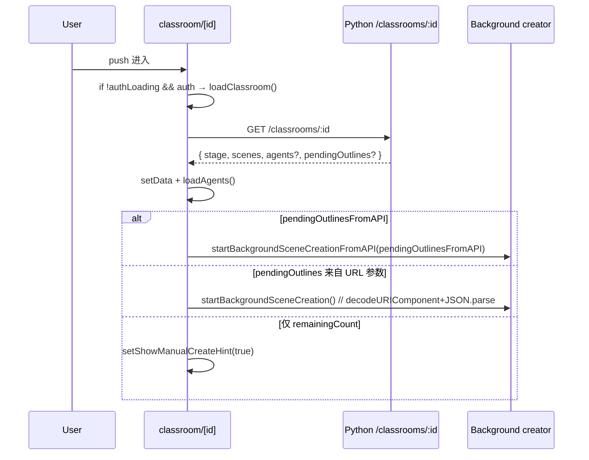
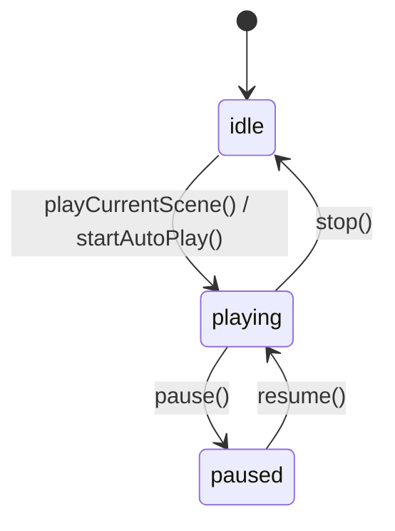
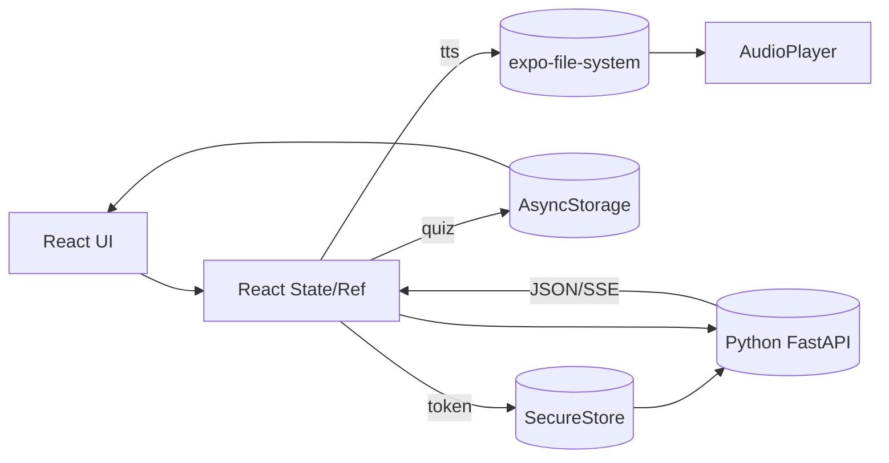
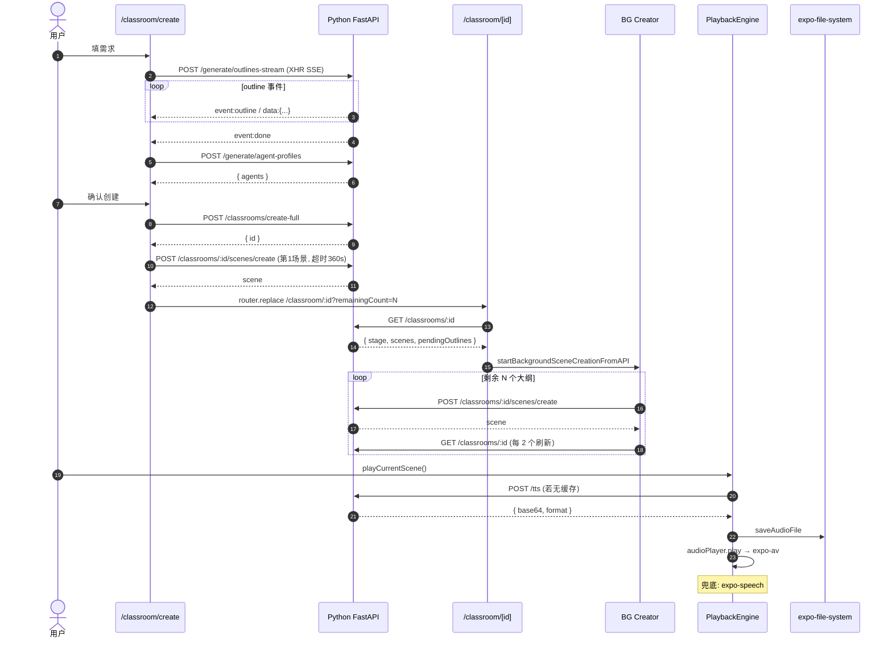

# 移动端业务流程与数据处理深度解析

> 本文与 [web-business-flow.md](./web-business-flow.md) 互为对照，
> 针对 `packages/mobile/` 下的 Expo React Native 应用，梳理其**代码结构**、
> **调用链路**、**状态与数据流动**，并说明与 Web 端的架构差异。
> 所有路径以仓库根目录为起点。

---

## 0. 全局架构速览

### 0.1 技术栈

| 层级 | 技术 |
|------|------|
| 运行时 | Expo SDK + React Native |
| 路由 | `expo-router`（文件系统路由） |
| 语言 | TypeScript |
| HTTP | `axios`（拦截器做 Token / 401 刷新） |
| 凭证存储 | `expo-secure-store`（iOS Keychain / Android Keystore），Web 回退 `localStorage` |
| 数据缓存 | `@react-native-async-storage/async-storage`（Quiz 草稿/答案/结果） |
| 文件存储 | `expo-file-system`（TTS 音频 `.mp3`） |
| 音频播放 | `expo-av`（原生）+ `window.Audio`（Web） |
| 语音合成 | `expo-speech`（兜底） + 后端 `/tts` API |
| 手势/动画 | `react-native-gesture-handler` + `react-native-reanimated` |
| 触觉反馈 | `expo-haptics` |
| 状态管理 | React `useState` + `useRef` + `AuthContext`（**未使用 Zustand**） |
| 后端 | **直连** `packages/server-python/`（FastAPI） |

### 0.2 与 Web 端核心差异

| 维度 | Web 端（根 `app/`） | Mobile 端（`packages/mobile/`） |
|------|---------------------|--------------------------------|
| 后端 | 同域 Next API Routes | **跨域直连 Python FastAPI** |
| 认证 | sessionStorage 流转 | Bearer Token + SecureStore |
| 状态管理 | Zustand + 多 Store | React 原生 state + AuthContext |
| SSE 实现 | `fetch` + `ReadableStream` | `XMLHttpRequest.onreadystatechange` |
| 大体积存储 | IndexedDB (Dexie) | expo-file-system (mp3) / AsyncStorage (JSON) |
| 生成流程 | 8 步流水线 | 4 步（需求→大纲→Agent→首场景） |
| 续跑 | `useSceneGenerator` 客户端串行 | `startBackgroundSceneCreationFromAPI` 串行 |
| TTS | 预生成 + Web Speech + 阅读计时器 | `/tts` API + expo-speech 兜底 |
| 播放引擎 | `lib/playback/engine.ts`（Web） | `packages/mobile/lib/playback/engine.ts`（RN） |

### 0.3 目录结构

```
packages/mobile/
├── app/                         # Expo Router 页面
│   ├── _layout.tsx              # 根布局 + AuthProvider
│   ├── (tabs)/                  # 底部 Tab 栈
│   │   ├── _layout.tsx
│   │   ├── index.tsx            # 首页
│   │   ├── courses.tsx          # 我的课程
│   │   ├── discover.tsx
│   │   ├── knowledge.tsx
│   │   ├── questions.tsx        # Phase2 问答
│   │   ├── notes.tsx            # Phase3 共享笔记
│   │   ├── buddy.tsx            # Phase3 学习搭子
│   │   ├── matching.tsx         # Phase3 学习匹配
│   │   ├── gamification.tsx     # Phase3 游戏化
│   │   ├── invite.tsx           # Phase2 邀请
│   │   ├── payment.tsx          # Phase2 支付
│   │   └── profile.tsx          # 个人中心
│   ├── auth/
│   │   ├── login.tsx
│   │   └── register.tsx
│   ├── classroom/
│   │   ├── create.tsx           # 4 步课程创建
│   │   └── [id].tsx             # ⭐ 79KB 课堂播放
│   ├── knowledge/[id]/          # 知识详情
│   ├── wallet.tsx               # 钱包
│   └── enterprise.tsx
│
├── components/
│   ├── classroom/               # WhiteboardOverlay 等
│   ├── playback/                # 播放控制组件
│   ├── slide/                   # Canvas / 元素渲染（16 个）
│   ├── common/ ui/
│   └── classroom-card.tsx
│
├── lib/
│   ├── api-client/index.ts      # ⭐ 46KB 统一 API（60+ 方法）
│   ├── auth/auth-context.tsx    # 认证 Context
│   ├── playback/                # 播放引擎
│   │   ├── engine.ts            # PlaybackEngine 状态机
│   │   └── audio-player.ts      # 跨平台音频播放
│   ├── quiz/persistence.ts      # Quiz 三层存储
│   ├── storage/audio-storage.ts # expo-file-system 封装
│   ├── classroom/complete-summary.ts
│   ├── configs/                 # 配置
│   ├── constants/theme.ts
│   ├── hooks/                   # use-classrooms / use-feedback
│   ├── i18n/                    # 国际化
│   └── types/                   # TS 类型
│
├── __tests__/                   # Jest
├── scripts/
├── ios/                         # 原生 iOS 工程
├── app.json / expo-env.d.ts
├── jest.config.js
├── package.json
└── tsconfig.json
```

> **注意冗余**：`packages/mobile/` 根下存在 `dist-test/` … `dist-test6/` 六份 Web 构建产物（约 120 个条目），建议清理或加入 `.gitignore`。

---

## 1. 启动链路与认证

### 1.1 根布局 `app/_layout.tsx`

```tsx
<SafeAreaProvider>
  <AuthProvider>                // 1) 恢复登录态
    <StatusBar style="auto" />
    <Stack screenOptions={{ headerShown: false }}>
      <Stack.Screen name="(tabs)" />
      <Stack.Screen name="classroom/[id]" options={{ title: '课程详情' }} />
      <Stack.Screen name="classroom/create" />
      <Stack.Screen name="auth/login" />
      ...
    </Stack>
  </AuthProvider>
</SafeAreaProvider>
```

### 1.2 `AuthProvider`（`lib/auth/auth-context.tsx`）

**跨平台凭证封装**（内嵌 `storage`）：
```ts
const storage = {
  getItem:   (k) => Platform.OS === 'web' ? localStorage.getItem(k) : SecureStore.getItemAsync(k),
  setItem:   (k,v) => Platform.OS === 'web' ? localStorage.setItem(k,v) : SecureStore.setItemAsync(k,v),
  deleteItem:(k) => Platform.OS === 'web' ? localStorage.removeItem(k) : SecureStore.deleteItemAsync(k),
}
```

**键位**：`auth_token` / `refresh_token` / `user_data`。

**登录/注册流程**（对 Python `/auth/login`、`/auth/register`）：
```
POST /auth/login → { access_token, refresh_token, user }
  → storage.setItem(TOKEN_KEY / REFRESH_TOKEN_KEY / USER_KEY)
  → setUser(response.user)
  → apiClient.setToken(access_token)   // 注入 axios 默认头
```

**挂载恢复**：`useEffect(() => loadStoredAuth(), [])` 读 SecureStore，若 `token && userData` 存在则自动登录。

### 1.3 ApiClient Token 生命周期

文件：`lib/api-client/index.ts`（46KB，60+ 方法）。

```ts
const API_BASE_URL = process.env.EXPO_PUBLIC_API_URL || 'http://192.168.1.110:8000'

class ApiClient {
  private client = axios.create({ baseURL: API_BASE_URL, timeout: 30000 })
  private token: string | null = null

  constructor() {
    // 请求拦截：注入 Authorization
    this.client.interceptors.request.use(cfg => {
      if (this.token) cfg.headers.Authorization = `Bearer ${this.token}`
      return cfg
    })

    // 响应拦截：401 自动刷新 token 并重试
    this.client.interceptors.response.use(r => r, async err => {
      if (err.response?.status === 401) {
        const refreshToken = await storage.getItem('refresh_token')
        if (refreshToken) {
          const { data } = await axios.post(`${API_BASE_URL}/auth/refresh`, { refresh_token: refreshToken })
          this.setToken(data.access_token)
          await storage.setItem('auth_token', data.access_token)
          err.config.headers.Authorization = `Bearer ${data.access_token}`
          return this.client.request(err.config)   // 重放原请求
        }
      }
      return Promise.reject(err)
    })
  }
}
```

要点：
- **刷新只做一次**：若刷新也失败则清空 token，下一次请求继续 401；
- **非单例 axios 实例**：SSE / XHR 场景（见下文）不走拦截器，需手动带 token。

---

## 2. 阶段 A —— 课程创建（`classroom/create.tsx`）

与 Web 端 8 步流水线不同，Mobile 端将流程压缩为 **4 步线性向导**（`STEPS = ['需求输入','大纲生成','智能体生成','确认创建']`），每步自动推进下一步。

```mermaid
graph LR
    S1[1 需求输入] --> S2[2 SSE 大纲流]
    S2 --> S3[3 Agent 生成]
    S3 --> S4[4 创建课程 + 首场景]
    S4 --> CR[/classroom/id]
```

### 2.1 步骤 1：需求输入
- 输入 `requirement`（必填）
- 选 `language`（zh-CN / en-US）
- 切 `webSearchEnabled`
- `handleStep1Next()` → 验证非空 → `setCurrentStep(1)` → `generateOutlines()`

### 2.2 步骤 2：SSE 大纲流

**关键**：Mobile 不能用 `fetch + ReadableStream`（RN 环境不支持），改用 `XMLHttpRequest.onreadystatechange` 分片解析。

```ts
await apiClient.generateOutlinesStream(
  requirement, language, agents, webSearchEnabled,
  onOutline: (outline) => {
    outlinesRef.current = [...outlinesRef.current, outline]   // ref 避免闭包过时
    setOutlines(outlinesRef.current)
  },
  onComplete: async (count) => {
    setGeneratingOutlines(false)
    setCurrentStep(2)
    await generateAgents(outlinesRef.current)                 // 自动推进下一步
  },
  onError: (msg) => setError(msg),
)
```

内部实现：
```
POST /generate/outlines-stream
  xhr.onreadystatechange: readyState >= 3
    fullText - lastProcessedLength → newText
    newText 按行分割 → 识别 event:/data: 前缀
    currentEvent=outline → onOutline(data)
    currentEvent=done    → onComplete(data.count)
    currentEvent=error   → onError(data.error)
  timeout = 120s
```

**失败兜底**：若 `outlinesRef.current.length === 0`，加载 `DEFAULT_OUTLINES`（4 个预置大纲）。

### 2.3 步骤 3：Agent 生成

```ts
const result = await apiClient.generateAgentProfiles(
  { name: requirement.slice(0,50), description: requirement },
  language, outlinesData, ...
)
setAgents(result.agents.map(a => ({ ...a, enabled: true })))
setCurrentStep(3)
```

失败则 `apiClient.getDefaultAgents(language)`，再失败 `setAgents([])`。

### 2.4 步骤 4：创建课程 + 只生成第一个场景

```ts
// 1. 创建课程记录（不生成场景）
const result = await apiClient.createFullClassroom(
  name, description, outlines, agentIds, language, agentConfigs
)

// 2. 只创建第 1 个场景
await apiClient.createScene(result.id, outlines[0], 1, language)
// 超时设为 360000ms（6 分钟）以承受流式 LLM + TTS 的长耗时

setCreatedClassroomId(result.id)
router.replace(`/classroom/${result.id}?...&remainingCount=${outlines.length-1}`)
```

**设计考量**：首场景在创建页阻塞，其余场景留给课堂页后台续跑，等同于 Web 端的思路。

---

## 3. 阶段 B —— 课堂挂载与后台续跑

文件：`packages/mobile/app/classroom/[id].tsx`（79KB，2193 行）。

### 3.1 挂载序列（`loadClassroom`）



### 3.2 `loadAgents` 三级兜底

```
1. classroomData.stage.generatedAgentConfigs    // 生成时保存
2. classroomData.agents                         // API 响应
3. apiClient.getDefaultAgents('zh-CN')          // 默认 Agent
4. 内置 defaultFallbackAgents (4 个)             // 硬编码
```

每一级都做 `validateAgent + normalizeAgentColor`（校验 role 白名单、hex 颜色修复），保证下游渲染不崩。

### 3.3 后台续跑 `startBackgroundSceneCreationFromAPI`

```ts
for (let i = 0; i < outlines.length; i++) {
  const outline = outlines[i]
  const orderIndex = existingCount + i + 1
  try {
    await apiClient.createScene(id, outline, orderIndex, language)
    setCreatedScenesCount(i + 1)
    // 每 2 个场景或最后一个：刷新 classroom
    if ((i + 1) % 2 === 0 || i === outlines.length - 1) {
      const updatedData = await apiClient.getClassroom(id)
      setData(updatedData)
    }
  } catch (err) {
    console.warn(`场景 ${outline.title} 创建失败`, err)
    // 不中断，继续下一个（与 Web 端"失败即暂停"策略不同）
  }
}
```

**防并发**：`backgroundCreatingRef = useRef(false)`，`loadClassroom` 重入时不重复启动。

**与 Web 端差异**：Web 端失败即暂停等用户决策；Mobile 端失败即跳过下一个，最大化"能渲染多少就是多少"。

---

## 4. 阶段 C —— 播放引擎

文件：`packages/mobile/lib/playback/engine.ts`（585 行）+ `audio-player.ts`（391 行）。

### 4.1 状态机

```
EngineMode: 'idle' | 'playing' | 'paused'
```



> Mobile 无 `live` 子态（讨论态）；多 Agent 讨论以独立 Modal 实现，不侵入播放状态机。

### 4.2 双入口

| 入口 | 用途 | 行为 |
|------|------|------|
| `playCurrentScene()` | 手动翻页 | 只播当前场景，不自动切换 |
| `startAutoPlay()` | 连播 | 播完当前场景 `setTimeout(500ms)` 后自动 `nextScene()` |

### 4.3 Action 分发（`processSceneActions`）

```ts
const NON_SPEECH_SCENE_TYPES = ['quiz', 'interactive', 'pbl']  // 跳过 TTS

for (const action of actions) {
  callbacks.onActionExecute?.(action)
  switch (action.type) {
    case 'spotlight':     executeSpotlight(action); break        // 非阻塞
    case 'laser':         executeLaser(action); break            // 非阻塞
    case 'wb_draw_text':
    case 'wb_draw_shape': executeWhiteboard(action); break       // 非阻塞，自动开白板
    case 'wb_open':       callbacks.onWhiteboardOpen?.(); break
    case 'wb_clear':
    case 'wb_close':      callbacks.onClearEffects?.(); break
    case 'speech':        await executeSpeech(action); break     // 阻塞
  }
}
```

**与 Web 差异**：
- 无 `discussion` / `play_video` / `widget_show` 等类型（mobile 尚未支持）；
- 白板绘制触发自动打开覆盖层（`onWhiteboardOpen`）。

### 4.4 TTS 三级降级（`speakText`）

```ts
// L1 内存缓存
const cacheKey = `${provider}_${voice}_${text.length}_${text.slice(0,100)}`
if (audioCache.has(cacheKey)) {
  if (Platform.OS === 'web') audioPlayer.cacheAudio(audioId, base64, format)
  else                       saveAudioFile(audioId, base64, format)    // 写入 expo-file-system
  await audioPlayer.play(audioId, format)
  return
}

// L2 /tts API
if (provider !== 'browser') {
  const { success, base64, format, audioId } = await apiClient.generateTTS(text, audioId, provider, voice, speed, model, vcOptions)
  if (success) {
    audioCache.set(cacheKey, { base64, format })
    // Web: 直接入内存；Native: 落盘
    await audioPlayer.play(audioId, format)
    return
  }
}

// L3 expo-speech 兜底
await Speech.speak(text, { language:'zh-CN', rate: speed*0.9, onDone, onError })
```

### 4.5 跨平台音频播放（`audio-player.ts`）

| 平台 | 实现 | 资源管理 |
|------|------|----------|
| Web | `new window.Audio(URL.createObjectURL(blob))` | `onended` → `URL.revokeObjectURL` |
| Native | `Audio.Sound.createAsync({ uri })` | `setOnPlaybackStatusUpdate(didJustFinish)` + 60s 超时兜底 |

**权限与模式**：Native 首次播放前 `Audio.requestPermissionsAsync()` + `Audio.setAudioModeAsync({ playsInSilentModeIOS, staysActiveInBackground, shouldDuckAndroid })`。

---

## 5. 阶段 D —— 多 Agent 对话与讨论

### 5.1 单条 SSE 对话（`streamAgentChat`）

同 `generateOutlinesStream`，也走 `XMLHttpRequest`：

```
POST /chat  (headers: Accept: text/event-stream)
  event: start             → { agent_id }
  event: text_delta        → { agent_id, text }
  event: response_complete → { agent_id, content }
  event: end               → resolve
  event: error             → reject
```

前端以 `lastProcessedLength` 游标做增量分片解析，与 Web 的 `TextDecoder + split('\n\n')` 等价。

### 5.2 多 Agent 轮流讨论（`runMultiAgentDiscussion`）

非流式：`POST /chat/discussion { topic, agents, maxTurns }` 120s 超时，返回 `responses[]`，前端依次回调渲染气泡。

### 5.3 课堂内触发路径

`app/classroom/[id].tsx` 中：
- `startMultiAgentDiscussion(topic)` → 打开讨论 Modal
- `sendMessage()` → 单对单 SSE 流
- `extractKnowledge()` → 知识卡片抽取

---

## 6. 数据处理层：分层与生命周期

### 6.1 存储分层

| 层级 | 介质 | 生命周期 | 典型数据 |
|------|------|----------|----------|
| L0 | 内存 `Map`（`audioCache`/`webAudioCache`） | 引擎实例存活期 | TTS base64 缓存 |
| L1 | React `useState`/`useRef` | 组件存活期 | 场景数据 / UI 态 |
| L2 | `expo-secure-store` | 永久（系统钥匙串） | access_token / refresh_token / user_data |
| L3 | `AsyncStorage` | 永久 | Quiz 草稿 / 答案 / 结果 |
| L4 | `expo-file-system` | 永久（应用 Document 目录） | TTS `.mp3` / `.wav` |
| L5 | 后端 PostgreSQL | 永久 | 课堂 / 场景 / Agent / 交易 |

### 6.2 Quiz 三层存储（`lib/quiz/persistence.ts`）

```
quizDraft:<sceneId>    → 草稿答案（用户正在答）
quizAnswers:<sceneId>  → 已提交答案
quizResults:<sceneId>  → 批改结果
```

API 速查：
```ts
readDraft(sceneId)          → QuizAnswers
writeDraft(sceneId, ans)    → void
clearDraft(sceneId)         → void
readSubmittedState(sceneId) → { kind:'answering'|'reviewing', answers, results? } | null
writeSubmittedAnswers(...)  → 写 answers + 清 draft
writeSubmittedResults(...)  → 写 results
clearSubmitted(...)         → 支持重试
clearAllForScene(sceneId)   → multiRemove 三键
```

**设计要点**：
- 提交前**始终以 draft 为准**，保证断网也能答题；
- 提交后 draft 立即清理，防止重复提交；
- `readAnswersForSummary` 做汇总读取时 `answers → draft` 兜底。

### 6.3 TTS 音频存储（`lib/storage/audio-storage.ts`）

```ts
// Document/audio/<audioId>.<mp3|wav>
saveAudioFile(audioId, base64, format='mp3') → file.uri
saveAudioFileAsync(...)                      // setTimeout 推迟避免阻塞 UI
getAudioPath(audioId, format)                → string | null
deleteAudioFile(...) / clearAllAudioFiles()
listStoredAudioIds()                         // 目录扫描
```

Web 环境跳过文件系统，直接用内存 `webAudioCache`，避免 Blob URL 重复分配。

### 6.4 数据流向总图



---

## 7. API 矩阵（`lib/api-client/index.ts`）

按业务域分组（精选，完整见源文件）：

| 域 | 方法 | 端点 | 备注 |
|----|------|------|------|
| Auth | `login/register/getCurrentUser/logout/updateUser/changePassword/deleteAccount/exportData/getStats` | `/auth/*` | |
| Classroom | `getClassrooms/getClassroom/createClassroom/createFullClassroom/updateClassroom/deleteClassroom/createScene` | `/classrooms/*` | `createScene` 超时 360s |
| Generation | `generateOutlinesStream/generateOutlines/generateAgentProfiles/getDefaultAgents/generateSceneWithActions` | `/generate/*` | SSE via XHR |
| TTS | `generateTTS/getTTSVoices` | `/tts`/`/tts/voices` | 支持 qwen/openai/minimax/voxcpm |
| Chat | `streamAgentChat/runMultiAgentDiscussion/streamChat(legacy)` | `/chat*` | SSE via XHR |
| Token | `getTokenBalance/getTokenTransactions/exchangeTokens/getTokenPackages/purchaseTokens` | `/tokens/*` | |
| Points | `getPointsBalance/getPointsTransactions/getPointsSources/claimNewUserPackage` | `/points/*` | |
| Questions | `getQuestions/getQuestion/createQuestion` | `/questions` | Phase2 |
| Answers | `getAnswers/createAnswer/voteAnswer/acceptAnswer` | `/answers/*` | |
| Invite | `getMyInviteCode/getInvitationStats/applyInviteCode` | `/invitations/*` | |
| Payment | `getPaymentPackages/createPaymentOrder/getPaymentOrders/mockPayment` | `/payment/*` | |
| Buddy | `getBuddyTypes/getMyBuddyConfig/setBuddyConfig/getBuddyMessages/markBuddyMessageRead` | `/buddy/*` | Phase3 |
| Notes | `getNotes/...` | `/notes/*` | Phase3 |
| Matching / Gamification / Knowledge | … | `/matching/*`、`/gamification/*`、`/knowledge/*` | Phase3 |

所有调用统一走 `this.client`（axios 实例），享受：① token 自动注入；② 401 自动刷新重放；③ 30s 默认超时（生成类单独覆盖 120/360s）。

---

## 8. 端到端时序（创建 + 播放）



---

## 9. 异常与边界

| 场景 | 触发 | 处理 |
|------|------|------|
| Token 过期 | `401` | 拦截器自动 `/auth/refresh` + 原请求重试；再失败清空凭证 |
| SSE 401 | XHR 路径 | 单独走 `refreshToken()`，提示用户重试 |
| 大纲 SSE 超时 | 120s 未完成 | `onError('请求超时')`，回退 `DEFAULT_OUTLINES` |
| 首场景生成超时 | 360s | `createScene` 抛错 → 创建页显示 error |
| 后台续跑单场景失败 | `createScene` 抛错 | `console.warn` 后继续下一个（不中断） |
| TTS API 失败 | `/tts` 抛错 | 降级 `expo-speech`；若 `provider='browser'` 直接跳 L3 |
| 音频权限被拒 | `Audio.requestPermissionsAsync` | 返回 `false`，不播放；UI 不崩 |
| SecureStore 不可用 | Web | 自动 fallback `localStorage` |
| 播放器卡死 | native play 60s 无状态变化 | `setTimeout` 超时兜底 resolve(false) |
| Blob URL 泄漏 | 频繁切换 | `cleanupWebAudio` + `revokeObjectURL` |
| Agent 数据异常 | 字段缺失/颜色非法 | `validateAgent` 过滤 + `normalizeAgentColor` 降级 |

---

## 10. 与 Web 端差异对照

| 主题 | Web 端 | Mobile 端 |
|------|--------|-----------|
| 后端 | 同域 Next Route | 跨域 Python FastAPI |
| 认证 | sessionStorage 契约 | Bearer + SecureStore + 自动 refresh |
| 状态 | Zustand Store | React state + `useRef` |
| SSE | `fetch` ReadableStream | `XMLHttpRequest.onreadystatechange` |
| 大体积 | IndexedDB Dexie | expo-file-system + AsyncStorage |
| 生成 | 8 步（PDF/WebSearch/Agent/Outlines/Content/Actions/TTS/落盘） | 4 步（需求/Outlines/Agent/首场景） |
| PDF 解析 | `/api/parse-pdf` | ❌ 不支持 |
| Web 搜索 | 必经步骤 | 可选开关（由后端支持） |
| 续跑策略 | 串行 + epoch + 失败即暂停 | 串行 + ref 防并发 + 失败即跳过 |
| Action 类型 | speech/spotlight/laser/discussion/play_video/wb_*/widget_* | speech/spotlight/laser/wb_*（子集） |
| TTS | 预生成 + Web Speech + 阅读计时 | `/tts` API + expo-speech |
| 音频播放 | HTMLAudio | Native: expo-av / Web: window.Audio |
| 视频 | `play_video` action | ❌ |
| Widget 交互 | `widget_*` action | ❌（仅 quiz） |
| 多人协作 | — | 规划中（README 标注"待实现"） |

---

## 11. 当前实现的局限与优化点

参考 `packages/mobile/BUSINESS_LOGIC_ANALYSIS.md`，结合本次代码审查：

1. **Widget Action 播放缺失**：移动端 `PlaybackEngine` 未实现 `widget_show/widget_setState/widget_highlight`，Interactive 场景无法完整演示。
2. **无 PDF 入口**：移动端无法像 Web 端上传参考资料。
3. **无多人协作**：`README.md` 标注 WebSocket、白板绘制、课程创建（完整模式）均为"待实现"。
4. **状态管理分散**：`classroom/[id].tsx` 2193 行、`create.tsx` 795 行都是**巨组件**，状态集中在页面级 `useState`，建议引入 Zustand 或 `useReducer` 抽取。
5. **dist-test/ 冗余**：6 份 Web 构建产物应 `.gitignore` 或删除。
6. **SSE 实现重复**：`generateOutlinesStream` 与 `streamAgentChat` 两处 XHR 分片解析高度重复，可抽取 `createSSEClient(url, events)` 工具。
7. **TTS 缓存 key 碰撞风险**：`${provider}_${voice}_${text.length}_${text.slice(0,100)}` 对前 100 字相同但后续不同的文本会冲突，可改用 `hash(text)`。
8. **续跑失败静默**：与 Web 端"失败即暂停"相比，Mobile 端"失败即跳过"可能让用户进入残缺课堂而无感知，建议 Toast/Badge 提醒。
9. **Agent 生成硬编码 fallback**：`loadAgents` 中内置 4 个 agent 与 Python 端 `get_default_agents` 不一致，维护上有双份事实源。
10. **Alert 跨平台分支重复**：多处 `Platform.OS==='web' ? window.alert : Alert.alert` 可封装 `useFeedback.alert()`。

---

## 12. 开发者速查

**调试 SSE**：
- 真机无 DevTools → 用 `REACT_NATIVE_PACKAGER_HOSTNAME=<ip> expo start` 走真机 WiFi；
- 在 `xhr.onreadystatechange` 内 `console.log(xhr.readyState, xhr.responseText.length)`。

**新增后端 API**：
1. `lib/api-client/index.ts` 加方法；
2. 调用处：页面 / `playback/engine.ts` / `auth-context.tsx`。

**新增 Action 类型**：
1. `lib/types/scene.ts` 扩 `SceneAction` union；
2. `lib/playback/engine.ts` `processSceneActions` 加 case；
3. `PlaybackEngineCallbacks` 新增回调；
4. `app/classroom/[id].tsx` 在 `initPlaybackEngine` 里绑定回调。

**清理本地缓存**：
- Quiz：`clearAllForScene(sceneId)`；
- 音频：`clearAllAudioFiles()`；
- 登录态：`logout()`（内部清 token/user）。

**切换后端**：编辑 `.env` 中 `EXPO_PUBLIC_API_URL`，**必须重启 metro**。

---

## 13. 相关文档

- [Web 端业务流程](./web-business-flow.md) —— 根目录 Next 主体
- [课程生成流程](./course-generation-flow.md) —— Prompt 与 Agent
- [多 Agent 讨论](./deep-dive/multi-agent-discussion.md)
- [Python 路由矩阵](../api/python-routes.md)
- [移动端业务对齐分析](../../packages/mobile/BUSINESS_LOGIC_ANALYSIS.md)
- [PROJECT_STRUCTURE](../PROJECT_STRUCTURE.md)

---

_Last updated: 2026-04-27_
