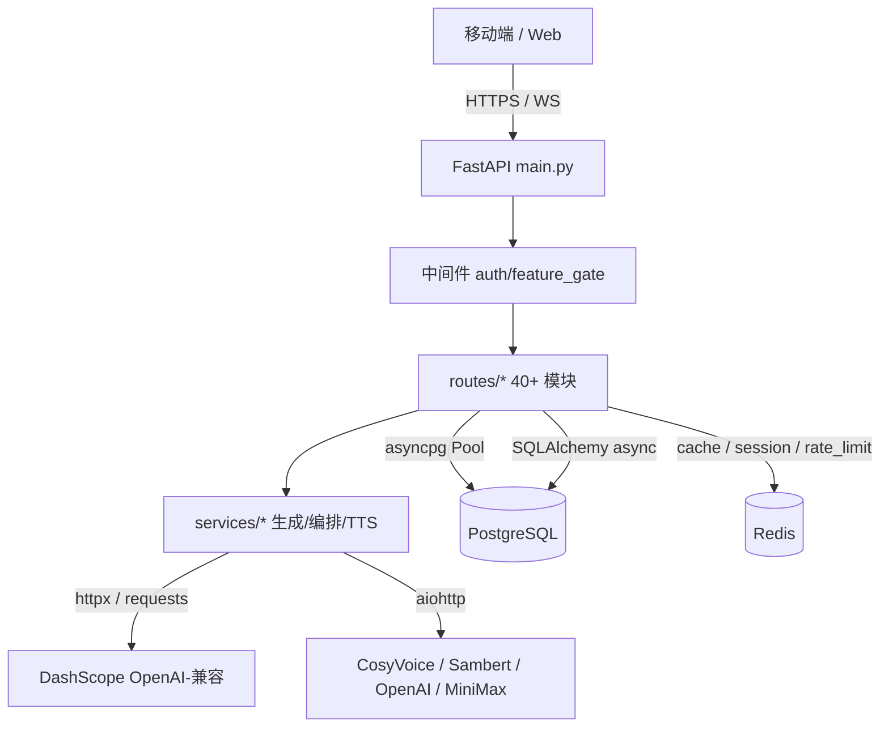
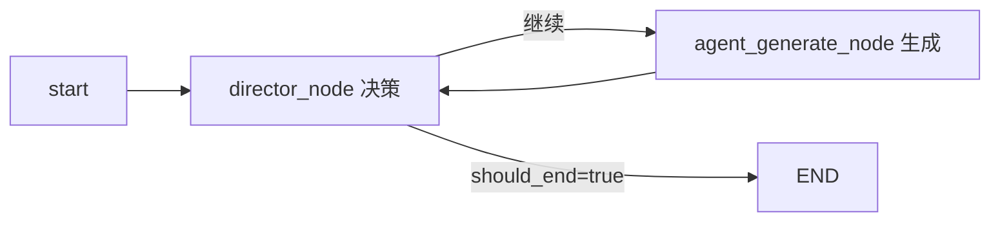
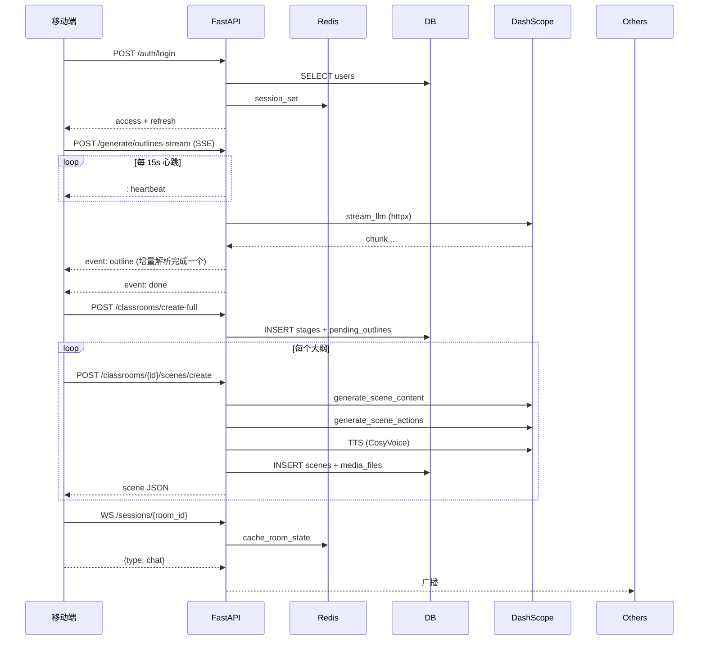

# Python 后端业务与数据流程分析

> 路径：`packages/server-python/`
> 作用：为移动端（Expo/React Native）与部分 Web 端场景提供统一的 FastAPI 后端服务，覆盖认证、课程生成、Agent 编排、多人课堂、TTS、Token 经济、支付等能力。
> 配套文档：`docs/design/web-business-flow.md`、`docs/design/mobile-business-flow.md`、`docs/design/course-generation-flow.md`

---

## 0. 架构速览



### 技术栈（`requirements.txt`）

| 层 | 依赖 | 说明 |
|---|---|---|
| Web | FastAPI 0.115 + uvicorn[standard] | ASGI，WebSocket 原生 |
| DB | asyncpg 0.30 + SQLAlchemy 2.0 async + Alembic | 高性能查询 + ORM |
| Cache | redis 5.2 (async) | 余额 / Session / 房间 / 限流 |
| LLM | langchain 0.3.7 + langgraph 0.2.45 + dashscope | OpenAI 兼容 + 多 Agent |
| HTTP | httpx + aiohttp + requests | 各自承担异步流/共享会话/SSL 降级 |
| Auth | python-jose + passlib[bcrypt] | JWT HS256 + bcrypt |
| Media | pypdf + pdf2image + Pillow | PDF 解析 / 图像处理 |

---

## 1. 启动链路与基础设施

### 1.1 入口 `app/main.py`（149 行）

- `lifespan`：
  - 启动期强制校验 `SECRET_KEY`（弱密钥/默认值直接拒绝启动，`TESTING_MODE` 下允许随机生成）。
  - 调用 `init_db()` 创建 asyncpg Pool + SQLAlchemy async engine；`init_redis()` 建立连接池。
  - 关闭时 `close_db()` / `close_redis()` 释放资源。
- `CORSMiddleware`：开发模式下额外放行 `192.168.1.110/114:8081/19000` 等局域网地址，便于 Expo 真机调试。
- 注册 **40+ 路由**（部分）：
  - 基础：`auth / users / subscriptions / feedback / tokens / points / payment / invites`
  - 课程：`classrooms / stages / scenes / media / generate`
  - 互动：`chat / classroom_sessions`（WebSocket）`/ roundtable / presentations`
  - 工具：`tts / translate / web_search / debug_prompts / health`

### 1.2 配置 `app/core/config.py`

- Pydantic `Settings` 支持 `.env`，关键项：
  - `OPENAI_API_BASE / OPENAI_API_KEY`：默认指向阿里云 DashScope OpenAI 兼容端点。
  - `DEFAULT_MODEL = "openai/glm-5"`；`MODEL_CAPABILITIES` 记录 vision 支持与 `max_output_tokens`。
  - `TTS_API_KEY / TTS_API_BASE` 独立（允许 TTS 走别的供应商）。

### 1.3 数据库 `app/db/database.py`

- **双通道**：
  - asyncpg `create_pool(min_size=5, max_size=20, command_timeout=60)`：高频热路径直接裸 SQL。
  - SQLAlchemy `async_sessionmaker`：复杂事务 / ORM。
- `_init_connection`：所有连接建立时 `SET TIME ZONE 'UTC'`，避免时区不一致。

### 1.4 Redis `app/core/redis.py`（226 行）

- `from_url(..., max_connections=20)` 单连接池。
- 能力封装：
  - `cache_get_json / cache_set_json`
  - `rate_limit_check(key, limit, window)`：`INCR + SETEX` 滑动窗口。
  - `session_set` 24h、`cache_token_balance` 5min、`cache_room_state` 2h。
- **降级策略**：Redis 不可用时 `if not redis_pool: return True`，关键链路不因缓存故障而阻断。

---

## 2. 认证与中间件

### 2.1 JWT `app/core/security.py`

| 能力 | 函数 | 有效期 |
|---|---|---|
| Access Token | `create_access_token(user_id, ttl)` | 30 分钟 |
| Refresh Token | `create_refresh_token(user_id)` | 7 天 |
| 校验 | `verify_token(token, expected_type)` | - |
| 密码 | `passlib.bcrypt` | - |

### 2.2 依赖注入 `app/middleware/auth.py`

- `HTTPBearer()` 解析 `Authorization: Bearer ...`。
- `get_current_user`：`verify_token → 查 users 表 → is_active → UserResponse`。
- `verify_token_from_ws(token)`：WebSocket 场景不依赖 DB（性能+稳定性），仅验证签名。

### 2.3 功能闸门 `app/middleware/feature_gate.py`

- `get_user_subscription(user_id)` → `check_feature_access(feature, plan)`：按订阅计划限制高级功能（视频生成、深度 PPT 等）。

### 2.4 OAuth

- `routes/auth.py` 预留 Apple / Google / WeChat 的 `oauth_login` 占位，统一落入 `oauth_accounts` 表。

---

## 3. 数据模型（`app/db/models.py`）

15 个核心 ORM 表：

| 领域 | 模型 |
|---|---|
| 账号 | `User / OAuthAccount / UserInvitationCode` |
| 课程 | `Stage`（课程）/ `Scene`（场景）/ `MediaFile / GenerationJob` |
| 经济 | `TokenAccount / PointAccount / TokenTransaction / PointTransaction / Order` |
| 社区 | `Question / Answer / AnswerVote` |

- 所有时间戳使用 `server_default=func.now()` 落 UTC。
- `Stage → Scene / MediaFile / GenerationJob` 为 `CASCADE` 删除（GDPR 删除用户时一并清理）。
- `TokenTransaction` / `PointTransaction` 作为审计流水，不可修改。

---

## 4. 课程生成流水线（核心）

### 4.1 路由分工 `app/routes/generate.py`（825 行）

| 路由 | 作用 |
|---|---|
| `POST /generate/parse-pdf` | PyPDF2 文本抽取 / LLM 视觉 OCR 双策略 |
| `POST /generate/web-search` | serper / google 联网搜索（配合 SSRF guard） |
| `POST /generate/outlines` | 同步一次性生成大纲 |
| `POST /generate/outlines-stream` | **SSE 流式**，15s heartbeat + 2 次重试 + 失败降级 |
| `POST /generate/agent-profiles` | 同时支持 Web 格式（`stageInfo`）与移动端格式（`stage_name`） |
| `GET /generate/default-agents` | 免鉴权默认 5 Agent（1 师 +1 助 +3 生） |
| `POST /generate/classroom` | 异步整体生成，写 `GenerationJob` |
| `POST /generate/scene-content` / `scene-actions` / `scene-with-actions` | 单场景两阶段拆分 / 一体化（含 TTS base64） |
| `POST /generate/tts` | provider 白名单 `qwen/openai/minimax`，文本上限 4000 字 |

### 4.2 大纲增量解析 `services/generation/outline_generator.py`

- `SceneOutline` Pydantic：含 `widget_type / widget_outline / media_generations`。
- `extract_new_outlines(buffer)`：SSE 片段累加时，实时追踪 `{}` 深度 + 字符串 / 转义状态，一旦一个完整 JSON 对象闭合即向客户端推送，**无需等整个数组结束**。
- PDF 内容截断 `MAX_PDF_CONTENT_CHARS = 8000`。
- 失败兜底 `generate_smart_default_outlines`：基于主题模板构造 5 ~ 8 个默认场景，保证"永远有内容"。

### 4.3 场景两阶段生成 `services/scene_service.py`（561 行）

```
create_single_scene(outline)
 ├── generate_scene_content(outline)   → 文本 / 讲解 / key_points
 ├── generate_scene_actions(content)   → 时间轴 actions + canvas 元素
 └── 任一失败 → create_fallback_scene  （空 canvas + 基础 actions）
```

- 校验常量：`SUPPORTED_LANGUAGES=4 / SUPPORTED_SCENE_TYPES=4 / MAX_TTS_TEXT_LENGTH=4000 / MAX_SCENES_PER_REQUEST=20`。
- `create_stage_record` 对 `agent_configs` 做严格校验：**最多 10 个 Agent**、必填 `id/name/role`、`role` 必须在白名单内。

### 4.4 Agent 生成 `services/generation/agent_generator.py`

- `AGENT_COLOR_PALETTE` 8 色循环；`DEFAULT_VOICE_CONFIGS` 5 套音色。
- `AGENT_PROMPT_TEMPLATE`：将 `system_prompt` **合并进 user prompt**，规避 DashScope 对 system 字段偶发超时。
- `get_default_agents()`：**张老师 / 李助教 / 好奇小明 / 学霸小红 / 活泼小刚**，免鉴权可直接拉取。

### 4.5 LLM 抽象 `services/llm.py`（451 行）

| 接口 | 底层 | 用途 |
|---|---|---|
| `call_llm(prompt, model)` | `requests.Session(verify=False)` + `asyncio.to_thread` | **解决 DashScope SSL 兼容**（httpx 握手偶发失败） |
| `stream_llm(messages)` | `httpx.AsyncClient.stream` (600s / 3 次重试) | SSE 流，失败自动回落 `call_llm` 非流式 |
| `call_llm_with_vision(msgs)` | `qwen-vl-max` | PDF/图像 OCR |

- `MODEL_REMAP`：`gpt-4o → qwen-plus`、`gpt-3.5-turbo → qwen-turbo`、`claude-3-opus → qwen-max`。
- Chat 专用 `CHAT_MODEL = "qwen3.5-plus"`，**不经 remap**，保证对话专用模型稳定。

---

## 5. Agent 编排（LangGraph）

`app/services/orchestration/director_graph.py`（373 行）

### 5.1 7 种角色 Prompt

`AGENT_SYSTEM_PROMPTS` = **商业策略四件套**（`chief_analyst / market_expert / competition_expert / finance_risk_expert`）+ **教育三件套**（`teacher / student / assistant`）。

### 5.2 按主题切换轮转表

```python
# 关键词触发 → BUSINESS
trigger = ["商业", "策略", "市场", "竞争", "分析", "SWOT", "Porter", "财务", "风险"]
BUSINESS_AGENT_ROTATION   # 5 步：分析师 → 市场 → 竞争 → 财务 → 分析师总结
EDUCATION_AGENT_ROTATION  # 3 步：teacher → student → assistant
```

### 5.3 StateGraph



- `DirectorState`（TypedDict）：`messages / turn_count / current_agent / should_end`。
- `stream_agent_response(agent, state, model=None)`：默认 `effective_model = "qwen3.5-plus"`；逐 token 产出供上层 SSE/WebSocket 广播。
- `run_multi_agent_discussion(topic, agents)`：`POST /chat/discussion` 的底层实现。

---

## 6. WebSocket 多人课堂

`app/routes/classroom_sessions.py`（658 行）

### 6.1 内存态数据结构

```
ClassroomRoom              ← 单房间状态
 ├── participants: Dict[user_id, WebSocket]
 ├── whiteboard: List[Element]  (cap 200)
 ├── message_history: deque      (cap 1000)
 └── rate_limit: Dict[uid, List[ts]]

RoomManager                ← 全局单例
 └── rooms: Dict[room_id, ClassroomRoom]
```

### 6.2 约束常量

| 项 | 上限 |
|---|---|
| `MAX_MESSAGE_LENGTH` | 1000 字 |
| `MAX_MESSAGE_HISTORY` | 1000 条 |
| `MAX_PARTICIPANTS` | 50 人 |
| `MAX_WHITEBOARD_ELEMENTS` | 200 |
| `RATE_LIMIT_MESSAGES` | 10 条 / 秒 |

### 6.3 安全措施

- `validate_room_id`：正则 `^room_[a-f0-9\-]+_[a-f0-9]{8}$` 防伪造。
- `hash_user_id`：SHA256 前 8 位，广播时不暴露真实 id。
- `sanitize_content`：清理 HTML 防 XSS。
- `check_rate_limit`：滑动 1s 窗口。

### 6.4 消息类型

| type | 说明 |
|---|---|
| `chat` | 聊天文本 |
| `whiteboard_action` | 绘制 / 擦除 / 清屏 |
| `scene_change` | **仅房主**可切换场景 |
| `request_agent` | 触发 Agent 回复，内部调 `stream_agent_response` 逐片广播 |
| `reaction` | 点赞 / 举手 |
| `ping` | 心跳 |

---

## 7. 经济系统（Token + 积分）

### 7.1 双账户 `app/routes/tokens.py`（446 行）+ `points.py`

| 档位 | 特点 |
|---|---|
| `TOKEN_PACKAGES` | `basic / standard / premium`（首购 50% 折扣） |
| `TOKEN_EXCHANGE_RATES` | `small / standard / large`（档位越高兑换效率越高） |

### 7.2 事务安全

所有资金流向 **强制 `SELECT ... FOR UPDATE`** 行级锁：

```python
async with pool.acquire() as conn:
    async with conn.transaction():
        await conn.execute("SELECT ... FROM token_accounts WHERE user_id=$1 FOR UPDATE")
        # 扣减 / 增加 / 写流水
        await invalidate_balance_cache(user_id)
```

- 扣费：`POST /tokens/spend`
- 奖励：`POST /tokens/reward`（签到 / 邀请 / 首次完课）
- 兑换：`POST /tokens/exchange`（积分 → Token，同时锁两张表）
- 注册赠送：**200 Token + 500 积分**。

### 7.3 支付 `app/routes/payment.py`

- 微信支付 / 支付宝，签名依赖 `WECHAT_PAY_API_KEY / ALIPAY_PUBLIC_KEY`。
- 首购 50% 折扣通过查 `orders` 表判定历史订单数实现。
- ⚠️ 当前版本签名校验部分仍为 TODO（见"局限"）。

---

## 8. 数据分层与缓存

| 层 | 实例 | 典型使用 |
|---|---|---|
| PostgreSQL | 主库 | 持久化 users / stages / scenes / orders |
| asyncpg Pool | 5 ~ 20 连接 | 热路径 SQL |
| SQLAlchemy async | engine | 复杂事务 / ORM 查询 |
| Redis | 连接池 20 | 余额缓存 5min、Session 24h、房间 2h、限流 |
| 进程内存 | `ClassroomRoom / RoomManager` | WebSocket 房间瞬态 |

缓存失效策略：所有 Token/积分写入后显式 `invalidate_balance_cache(user_id)`；场景/课程读多写少直接走 DB。

---

## 9. TTS 多级降级（`services/tts_service.py`）

```
provider=qwen
  ├─ CosyVoice (tts_v2) 7 音色  ← 默认
  │   └─ 失败
  └─ Sambert     (tts)   5 音色  ← 降级

provider=openai  → alloy/echo/fable/onyx/nova/shimmer
provider=minimax → MiniMax TTS
```

- 通过共享 `aiohttp.ClientSession` 减少握手开销。
- 随机分配音色（不同 Agent 声音差异化）。
- `DASHSCOPE_MODELS` 映射：`qwen3-tts-flash → cosyvoice-v2`、`qwen-tts → cosyvoice-v1`、`sambert → sambert-zhichu-v1`。

---

## 10. 安全措施总览

| 关注点 | 实现 |
|---|---|
| SSRF | `core/ssrf_guard.py`：黑名单 `10./172.16-31./192.168./127./localhost/::1/fc00:/fe80:/::ffff:`，禁端口 `22/23/25/53/110/143/993/995/3306/5432/6379/8080`，协议白名单 http/https |
| SECRET_KEY | 启动期强制非默认 / 非弱值，否则拒启动 |
| 密码 | bcrypt 12 轮 |
| SQL 注入 | asyncpg 参数化 + SQLAlchemy |
| 并发资金 | FOR UPDATE 行级锁 |
| XSS | WebSocket `sanitize_content` |
| GDPR | `/auth/me/export` 打包 users/stages/scenes/media/oauth/jobs；`DELETE /auth/me` CASCADE |
| WebSocket 身份 | `verify_token_from_ws` 无 DB 查询仅签名校验 |
| 速率限制 | 房间 10/s、rate_limit_check 工具 |

---

## 11. 端到端时序：移动端生成一节课



---

## 12. 异常与降级矩阵

| 故障点 | 降级策略 |
|---|---|
| DashScope SSL 握手 | `requests.Session(verify=False)` + `asyncio.to_thread` |
| `stream_llm` 中断 | 重试 3 次 → 回落 `call_llm` 非流式 |
| 大纲生成失败 | `generate_smart_default_outlines` 默认 5~8 场景 |
| 场景生成失败 | `create_fallback_scene` 空白 + 基础讲解 |
| CosyVoice 失败 | 自动切 Sambert |
| Redis 不可用 | 限流 / 缓存返回 True，业务不阻断 |
| WebSocket 超限 | 拒绝单连接，不影响房间其他人 |
| LLM 模型不可用 | `MODEL_REMAP` 映射到可用 qwen 型号 |

---

## 13. API 矩阵（精选）

| 分组 | 路由 | 方法 |
|---|---|---|
| 认证 | `/auth/register /login /refresh /oauth /me /me/export /stats` | POST/GET/DELETE |
| 课程 | `/classrooms /classrooms/{id} /classrooms/create-full /{id}/scenes/create` | GET/POST/DELETE |
| 生成 | `/generate/outlines /outlines-stream /scene-content /scene-actions /scene-with-actions /agent-profiles /default-agents /parse-pdf /web-search /tts /classroom` | POST |
| 聊天 | `/chat /chat/discussion` | POST (SSE) |
| 多人 | `/sessions/{room_id}` | WebSocket |
| 经济 | `/tokens/balance /tokens/exchange /tokens/spend /tokens/reward /tokens/packages /tokens/purchase` | GET/POST |
| 支付 | `/payment/wechat /payment/alipay /payment/callback` | POST |
| 订阅 | `/subscriptions /subscriptions/plans` | GET/POST |
| 运维 | `/health` | GET |

---

## 14. 与 Web / Mobile 端的对照

| 维度 | Web (Next.js) | Python 后端 | Mobile (Expo) |
|---|---|---|---|
| 生成入口 | `app/api/generate/*` Next API | `/generate/*` | 直接调 Python `/generate/outlines-stream` |
| Agent 编排 | `lib/orchestration/` client 端 | `director_graph` LangGraph 服务端 | 调 Python `/chat/discussion` |
| 多人课堂 | WebSocket 客户端 | `classroom_sessions` 服务端房间 | 同 Python WS |
| TTS | Azure / 客户端 | CosyVoice / Sambert / OpenAI | 调 Python `/generate/tts` |
| 认证 | Next 客户端存储 | 颁发 JWT | 使用 Python JWT |
| 模型 | OpenAI / DashScope 直连 | DashScope 兼容层 + MODEL_REMAP | 全部委托 Python |

**定位**：Web 端保留了部分自生成能力（可独立运行），移动端更轻，**几乎所有业务/生成/编排都依赖 Python 后端**。

---

## 15. 当前局限与优化建议

| 问题 | 现状 | 建议 |
|---|---|---|
| `ClassroomRoom` 非分布式 | 进程内存，多实例扩容会破裂 | 迁移 Redis Pub/Sub 或 LiveKit |
| 支付签名 | WeChat/Alipay 回调签名 TODO | 补 RSA/HMAC 验证 |
| TTS 配额 | 无按用户配额追踪 | 接 `TokenAccount` 扣费 |
| WebSocket Agent 模型硬编码 | 部分路径默认 `gpt-4o-mini` | 改走 `settings.DEFAULT_MODEL` |
| `verify=False` | DashScope SSL 禁校验 | 升级 httpx + 固定 CA 后开启 |
| LangGraph 状态持久化 | 仅内存 | 用 `RedisSaver` 支持断点续话 |
| `agent_configs` 限制 10 | 硬编码 | 抽 settings 可配 |
| Alembic migrations | README 提到但脚本薄弱 | 对齐 `db/models.py` 当前表结构 |

---

## 16. 开发者速查

### 16.1 本地启动

```bash
cd packages/server-python
python -m venv .venv && source .venv/bin/activate
pip install -r requirements.txt
cp .env.example .env          # 填 OPENAI_API_KEY / SECRET_KEY / DATABASE_URL / REDIS_URL
alembic upgrade head
uvicorn app.main:app --reload --port 8000
```

### 16.2 关键环境变量

| 变量 | 必填 | 说明 |
|---|---|---|
| `SECRET_KEY` | ✅ | 启动期强校验 |
| `DATABASE_URL` | ✅ | `postgresql+asyncpg://...` |
| `REDIS_URL` | ✅ | `redis://...` |
| `OPENAI_API_KEY / OPENAI_API_BASE` | ✅ | DashScope 或自建 |
| `TTS_API_KEY / TTS_API_BASE` | ⭕ | 未设则复用 OPENAI |
| `WECHAT_PAY_API_KEY / ALIPAY_PUBLIC_KEY` | ⭕ | 开启支付时需要 |
| `TESTING_MODE` | ⭕ | 允许弱 SECRET_KEY，禁止生产使用 |

### 16.3 关键文件地图

| 关注点 | 入口 |
|---|---|
| 服务启动 | [main.py](file:///Users/xuning/workspace/project/git/ML/openmaic-business/packages/server-python/app/main.py) |
| 配置 | [config.py](file:///Users/xuning/workspace/project/git/ML/openmaic-business/packages/server-python/app/core/config.py) |
| 认证 | [security.py](file:///Users/xuning/workspace/project/git/ML/openmaic-business/packages/server-python/app/core/security.py) / [middleware/auth.py](file:///Users/xuning/workspace/project/git/ML/openmaic-business/packages/server-python/app/middleware/auth.py) |
| DB | [database.py](file:///Users/xuning/workspace/project/git/ML/openmaic-business/packages/server-python/app/db/database.py) / [models.py](file:///Users/xuning/workspace/project/git/ML/openmaic-business/packages/server-python/app/db/models.py) |
| Redis | [redis.py](file:///Users/xuning/workspace/project/git/ML/openmaic-business/packages/server-python/app/core/redis.py) |
| 生成路由 | [routes/generate.py](file:///Users/xuning/workspace/project/git/ML/openmaic-business/packages/server-python/app/routes/generate.py) |
| 课程路由 | [routes/classrooms.py](file:///Users/xuning/workspace/project/git/ML/openmaic-business/packages/server-python/app/routes/classrooms.py) |
| 多人课堂 | [routes/classroom_sessions.py](file:///Users/xuning/workspace/project/git/ML/openmaic-business/packages/server-python/app/routes/classroom_sessions.py) |
| 大纲生成 | [outline_generator.py](file:///Users/xuning/workspace/project/git/ML/openmaic-business/packages/server-python/app/services/generation/outline_generator.py) |
| 场景生成 | [scene_service.py](file:///Users/xuning/workspace/project/git/ML/openmaic-business/packages/server-python/app/services/scene_service.py) |
| Agent 生成 | [agent_generator.py](file:///Users/xuning/workspace/project/git/ML/openmaic-business/packages/server-python/app/services/generation/agent_generator.py) |
| LangGraph | [director_graph.py](file:///Users/xuning/workspace/project/git/ML/openmaic-business/packages/server-python/app/services/orchestration/director_graph.py) |
| LLM 抽象 | [llm.py](file:///Users/xuning/workspace/project/git/ML/openmaic-business/packages/server-python/app/services/llm.py) |
| TTS | [tts_service.py](file:///Users/xuning/workspace/project/git/ML/openmaic-business/packages/server-python/app/services/tts_service.py) |
| Token | [routes/tokens.py](file:///Users/xuning/workspace/project/git/ML/openmaic-business/packages/server-python/app/routes/tokens.py) |
| SSRF | [ssrf_guard.py](file:///Users/xuning/workspace/project/git/ML/openmaic-business/packages/server-python/app/core/ssrf_guard.py) |

---

> **总结**：Python 后端采用"FastAPI 统一网关 + 生成流水线 + LangGraph 编排 + WebSocket 课堂 + Redis 缓存 + PostgreSQL 事务"的典型架构，通过 MODEL_REMAP / 多级 TTS 降级 / SSE 增量解析 / FOR UPDATE 锁 / SSRF 守护等关键设计保证了在国内外 LLM 环境切换时的稳定性与资金安全。移动端是其首要消费方，业务能力边界（生成、编排、TTS、经济、课堂）全部集中在此服务。
