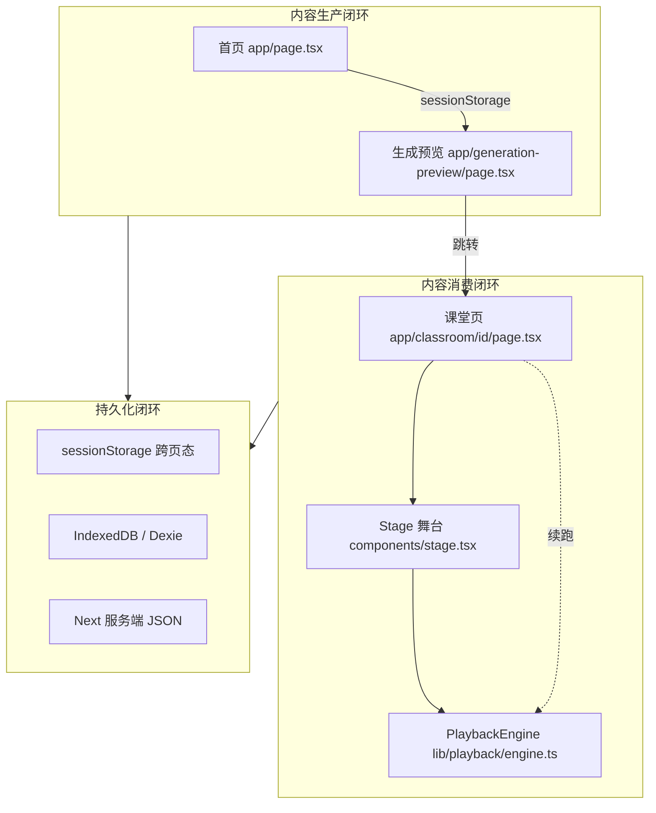
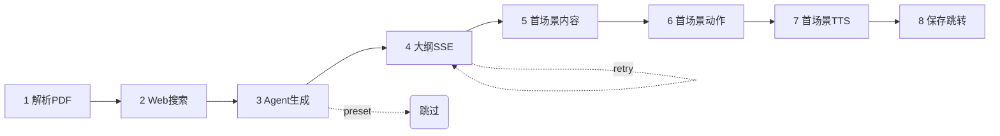
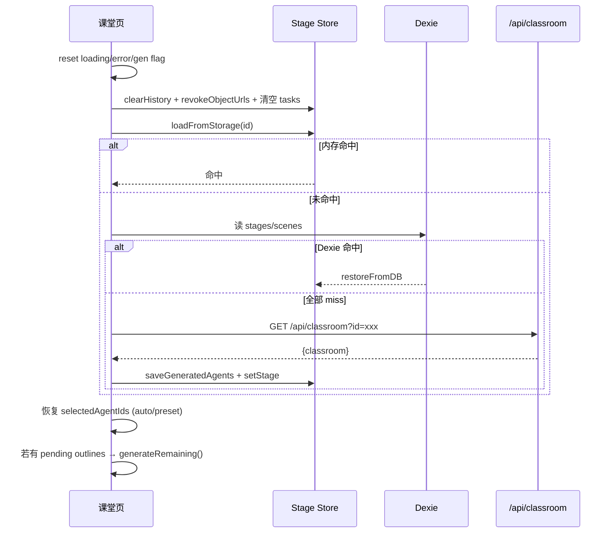
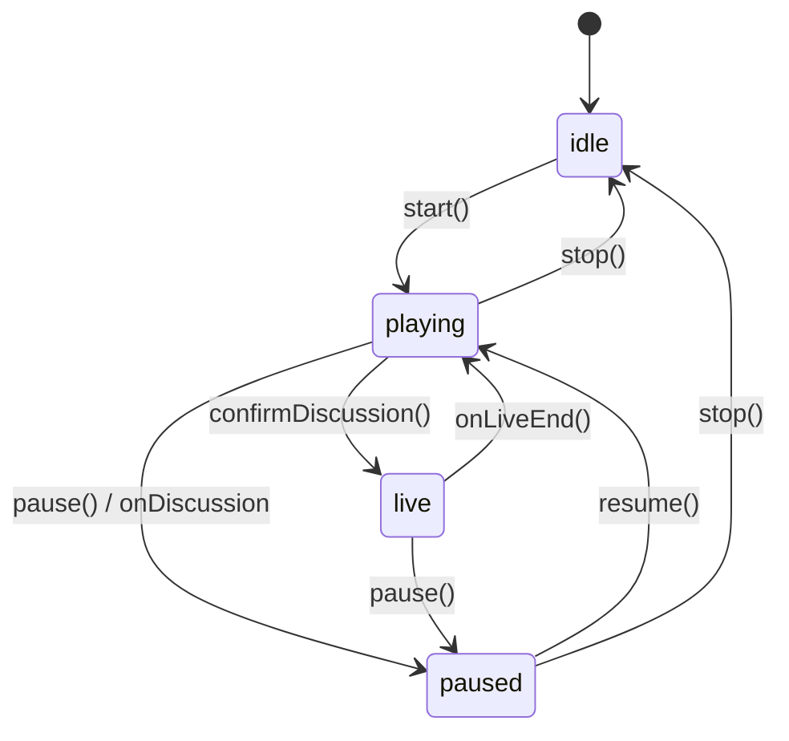
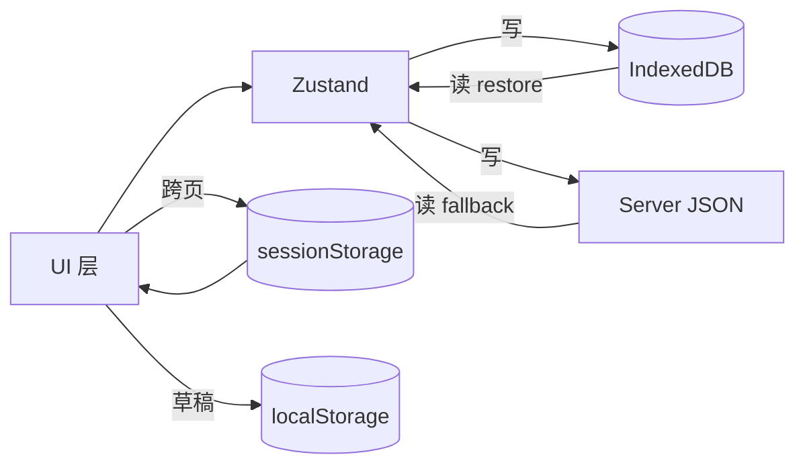
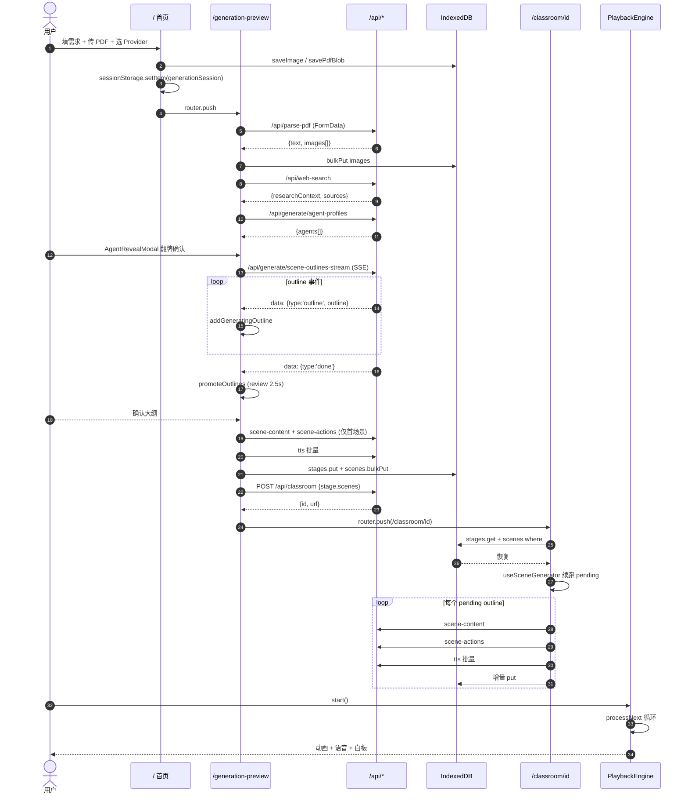

# Web 端业务流程与数据处理深度解析

> 本文在 [overview.md](./overview.md) 与 [course-generation-flow.md](./course-generation-flow.md) 基础上，
> 以**调用流程**与**数据处理**双主线，系统梳理仓库根目录 `app/` + `lib/` 内 Web 主体的
> 端到端业务闭环。所有文件路径均以仓库根为起点。

---

## 0. 全局架构速览

### 0.1 三大业务闭环



| 闭环 | 起点 | 终点 | 关键载体 |
|------|------|------|-----------|
| 生产 | `/` | `/generation-preview` | `sessionStorage['generationSession']` |
| 消费 | `/generation-preview` | `/classroom/[id]` | Stage Store + IndexedDB |
| 持久化 | 任意页 | Dexie / 服务端 JSON | `lib/store/stage.ts` + `app/api/classroom` |

### 0.2 代码层与职责

| 代码层 | 目录 | 职责 |
|---------|------|------|
| 页面（入口/编排） | `app/page.tsx`、`app/generation-preview/page.tsx`、`app/classroom/[id]/page.tsx` | React Server/Client Component，流程编排 |
| API 路由 | `app/api/**` | Next.js Route Handler，SSE / JSON / FormData |
| 业务 Store | `lib/store/**` | Zustand，跨组件状态 |
| 生成核心 | `lib/generation/**` | Pipeline、prompt、outline-generator、scene-builder |
| 播放引擎 | `lib/playback/engine.ts` | Action 状态机，动画/语音调度 |
| Hooks | `lib/hooks/**` | `useSceneGenerator` 等业务级 Hook |
| 存储 | `lib/utils/database.ts`、`lib/storage/**` | Dexie 封装 |
| AI/后端代理 | `lib/ai/**`、`lib/server/**` | 模型客户端、provider、prompt 组装 |

> 注：`docs/PROJECT_STRUCTURE.md` 中曾描述 `packages/main-project` 为 Web 主体，**实际代码位于仓库根目录** `app/`+`lib/`，`packages/` 下多为辅助子包。本文档以实际代码为准。

---

## 1. 阶段 A —— 首页需求录入

### 1.1 关键文件与 UI 元素
- 文件：`app/page.tsx`
- 核心状态：`requirements`、`pdfFileName`、`pdfStorageKey`、`pdfImages`、`imageStorageIds`、`pdfProviderId/Config`
- 草稿缓存：本地 `localStorage` 草稿键（表单内容自动回灌）

### 1.2 生成按钮的数据契约（行 327-368 摘要）

点击「开始生成」后，执行一次**一次性原子写入**：

```ts
const sessionState = {
  sessionId: nanoid(),            // 用于埋点和调试
  requirements,                    // 文本需求
  pdfText: '',                     // 由下一页解析 PDF 后回填
  pdfImages: [],                   // 同上
  imageStorageIds: [],             // 已上传图片的 IndexedDB key
  pdfStorageKey,                   // PDF 原文 blob 的 IndexedDB key
  pdfFileName,
  pdfProviderId,
  pdfProviderConfig,
  sceneOutlines: null,
  currentStep: 'generating' as const,
}
sessionStorage.setItem('generationSession', JSON.stringify(sessionState))
router.push('/generation-preview')
```

### 1.3 设计要点
1. **PDF 不走 URL**：大体积二进制放 IndexedDB，session 只存 `pdfStorageKey`（字符串），避免 `QuotaExceededError`。
2. **草稿与生成态解耦**：表单草稿存 `localStorage`，生成会话存 `sessionStorage`，刷新后两者互不污染。
3. **provider 锁定**：把用户在首页选择的 PDF / 图片 provider 一并写入 session，避免生成页再次读取（防止中途切换）。

---

## 2. 阶段 B —— 生成预览 8 步流水线

### 2.1 总览

文件：`app/generation-preview/page.tsx`（核心 `startGeneration` 函数 215-972 行）。



### 2.2 跨步骤机制

| 机制 | 实现 | 作用范围 |
|------|------|----------|
| **AbortController** | `abortRef = useRef<AbortController>()` | 每次 `startGeneration` 创建新实例，各 `fetch` 带 `signal`；用户取消/路由离开时 `abort()` |
| **previewPhase 状态机** | `preparing → outline-ready → review → generating-content` | 驱动 UI（进度条 / 大纲编辑器 / Agent 翻牌） |
| **generationParams 续跑参数** | `sessionStorage.setItem('generationParams', {...})` | 跳转 `/classroom/[id]` 前写入，供课堂页续跑剩余场景 |
| **Toast + Logger** | `toast.error` + `logger.debug` | 每一步失败都有 UI 反馈和结构化日志 |

### 2.3 步骤 1 —— PDF 解析（行 244-380）

**输入**：`pdfStorageKey` → IndexedDB 读 Blob → `FormData`
**调用**：`POST /api/parse-pdf`（`formData`，`signal`）
**处理**：
1. 从 Dexie 取出原文件 Blob，`formData.append('file', blob, fileName)`；
2. 附带 `providerId`、`providerConfig`（如 Azure Document Intelligence / PyMuPDF / Mistral OCR）；
3. 服务端返回 `{ text, images: string[] }`，其中 `images` 为 base64；
4. 客户端把 base64 逐个 **reserve** 到 IndexedDB（`storage.saveImage`），得到 `imageStorageIds[]`；
5. 对 `text` 按 `MAX_PDF_CONTENT_CHARS` 截断，回灌 session；
6. **清除 `pdfStorageKey`**：防止用户刷新后重复扫描同一个 PDF。

**数据变换路径**：
```
IndexedDB(Blob) → FormData → 解析服务端 → {text, base64[]} → IndexedDB(Image[]) + session.pdfText
```

### 2.4 步骤 2 —— Web 搜索（行 382-427）

**输入**：`requirements + pdfText` 摘要
**调用**：`POST /api/web-search` → 内部代理到第三方搜索或 LLM 搜索工具
**输出**：`{ researchContext: string, researchSources: Array<{ title, url }> }`
**写入**：Stage Store 的 `researchContext/researchSources`（后续所有生成 prompt 都会引用）
**失败容忍**：本步失败**不阻断**主流程，只 toast 提示并跳过，`researchContext` 置空字符串。

### 2.5 步骤 3 —— Agent Profiles 生成（行 620-772）

存在两个模式：

| 模式 | 触发条件 | 流程 |
|------|----------|------|
| `auto` | 首页未预选 Agent | `POST /api/generate/agent-profiles` 让 LLM 自行推荐 N 个 Agent |
| `preset` | 首页勾选了 Agent 模板 | 直接跳过接口调用，走本地映射 |

**成功后**：打开 `AgentRevealModal` 翻牌动画组件。页面在此处 `await` 一个用户交互 Promise（用户点击「确认」），**暂停流水线**。这是唯一一处**人工阻断点**。

### 2.6 步骤 4 —— 大纲 SSE 流式生成（行 461-558，核心）

**请求**：`POST /api/generate/scene-outlines-stream`（`Content-Type: application/json`，`signal` 继承自 abortRef）
**响应**：`text/event-stream`（标准 SSE 帧）

#### 2.6.1 事件协议
| 事件类型（`data.type`）| 载荷 | 客户端处理 |
|---------------------|------|-----------|
| `outline` | `{ outline: SceneOutline }` | `addGeneratingOutline(outline)`，UI 增量渲染 |
| `retry` | `{ attempt, reason }` | UI 显示「第 N 次重试」，不写入列表 |
| `languageDirective` | `{ language: 'zh-CN'\|'en' }` | 写入 Store，供后续 prompt 使用 |
| `done` | `{ outlines: SceneOutline[] }` | 用最终 list 覆盖 `generatingOutlines` → 提升为 `outlines`；`promoteOutlines()` |
| `error` | `{ message }` | toast + previewPhase 回退 |

#### 2.6.2 分帧解析
```ts
const reader = response.body!.getReader()
const decoder = new TextDecoder()
let buffer = ''
while (true) {
  const { done, value } = await reader.read()
  if (done) break
  buffer += decoder.decode(value, { stream: true })
  const parts = buffer.split('\n\n')
  buffer = parts.pop() ?? ''
  for (const frame of parts) {
    const line = frame.split('\n').find(l => l.startsWith('data: '))
    if (!line) continue
    const payload = JSON.parse(line.slice(6))
    handleEvent(payload)
  }
}
```

**要点**：
- `\n\n` 作分帧符；不完整帧保留在 `buffer`；
- `signal.aborted` 时立刻 `reader.cancel()` 释放连接；
- `generatingOutlines`（瞬态，不持久化）与 `outlines`（持久化）双列表设计，`done` 时一次性 promote，避免中途刷新残留脏数据。

### 2.7 步骤 5 —— `outline-ready → review` 审阅态（行 564-597）

大纲 SSE 完成后：
1. `previewPhase = 'outline-ready'`；
2. 启动 **2.5s 自动继续定时器**（用户若无操作则自动进入生成）；
3. 用户可在 `OutlinesEditor` 中增删改大纲；任何编辑动作都会 **清空定时器**并切到 `review`；
4. 用户点击「继续」→ `previewPhase = 'generating-content'`。

### 2.8 步骤 6~7 —— 首场景内容 / 动作（行 802-866）

流水线**只为第一个大纲**生成完整内容，目的：尽快让用户进入课堂，剩余场景在课堂页续跑。

调用顺序（串行 `await`）：
1. `POST /api/generate/scene-content` → 返回 `{ content, speakerScript }`（场景正文与 Agent 台词）
2. `POST /api/generate/scene-actions` → 返回 `{ actions: PlaybackAction[] }`（播放脚本）
3. TTS 批量：从 `actions` 中提取所有 `speech`，逐条 `POST /api/generate/tts` → 音频 blob 存 Dexie `audioFiles`

**失败分支**：任一步失败 → `addFailedOutline(outlineId, reason)` + toast；用户可在课堂页点「重试」。

### 2.9 步骤 8 —— 落盘 + 跳转（行 900-972）

1. 写 IndexedDB：`db.stages.put(stage)`、`db.scenes.bulkPut(scenes)`；
2. 写服务端：`POST /api/classroom { stage, scenes }` → 返回 `{ id, url }`；失败则仅本地可用；
3. 写 `sessionStorage['generationParams']`：
   ```ts
   { stageId, researchContext, researchSources, selectedAgentIds, generationMode, language }
   ```
   供课堂页续跑 pending outlines；
4. `router.push(\`/classroom/${stage.id}\`)`。

---

## 3. 阶段 C —— 课堂挂载与续跑

### 3.1 挂载生命周期

文件：`app/classroom/[id]/page.tsx`（行 107-178）



### 3.2 跨课堂污染防护

| 风险 | 防御 |
|------|------|
| Blob URL 残留 | `revokeObjectUrls()`：遍历 Store 中所有 `ObjectURL`，`URL.revokeObjectURL` |
| Store 场景混用 | `clearHistory()`：清空 tasks/messages/playback state |
| 续跑越界 | `generationEpoch++`：每次挂载自增，旧的 `useSceneGenerator` 循环检测到 epoch 不匹配会主动 break |
| 重复续跑 | `generationStartedRef = useRef(false)`：StrictMode 下双执行防护 |

### 3.3 续跑核心 —— `useSceneGenerator`（`lib/hooks/use-scene-generator.ts` 261-500 行）

```ts
const pending = outlines
  .filter(o => !completedOrders.has(o.order))
  .sort((a, b) => a.order - b.order)

for (const outline of pending) {
  if (abortRef.current?.signal.aborted) break
  if (generationEpoch !== currentEpoch) break

  try {
    const content = await genContent(outline, { signal })
    if (shouldBreak()) break
    const actions = await genActions(content, { signal })
    if (shouldBreak()) break
    const audios = await batchTTS(actions, { signal })
    commitScene({ outlineId: outline.id, content, actions, audios })
  } catch (err) {
    addFailedOutline(outline.id, err.message)
    setGenerationStatus('paused')
    return   // 不继续下一个，等待用户决策
  }
}
setGenerationStatus('completed')
```

**关键决策**：
- **串行而非并行**：避免 LLM 限流、保证场景前后文一致、控制内存峰值；
- **失败即暂停**：而非跳过，避免错误传染；
- **`retrySingleOutline(outlineId)`**：单独重试单个失败大纲，不影响其他场景。

### 3.4 Stage Store 字段总览（`lib/store/stage.ts` 1-120 行）

| 字段 | 持久化 | 说明 |
|------|--------|------|
| `stage` | ✅ | 课堂元信息 |
| `scenes` | ✅ | 已完成场景集合 |
| `outlines` | ✅ | 已确认大纲（稳定态） |
| `generatingOutlines` | ❌ | SSE 增量中，仅在 preview 页使用 |
| `generationStatus` | ❌ | `idle / generating / paused / completed / error` |
| `generationEpoch` | ❌ | 整数计数，防跨课堂污染 |
| `failedOutlines` | ✅ | `{ outlineId, reason, timestamp }[]` |
| `researchContext/Sources` | ✅ | Web 搜索结果 |
| `PENDING_SCENE_ID='__pending__'` | - | 虚拟场景 ID，供 UI 渲染"加载中卡片" |

---

## 4. 阶段 D —— 播放引擎

### 4.1 文件与状态机

文件：`lib/playback/engine.ts`（行 1-620）



### 4.2 核心循环 `processNext()`

```ts
while (!stopped) {
  const action = this.queue.shift()
  if (!action) break
  switch (action.type) {
    case 'speech':       await this.runSpeech(action); break
    case 'spotlight':    this.fireAndForget(() => this.runSpotlight(action)); break
    case 'laser':        this.fireAndForget(() => this.runLaser(action)); break
    case 'discussion':   await this.runDiscussion(action); break  // 可能跳入 live
    case 'play_video':   await this.runVideo(action); break
    case 'wb_draw':
    case 'wb_write':
    case 'wb_clear':     await this.runWhiteboard(action); break
    case 'widget_show':
    case 'widget_hide':  await this.runWidget(action); break
    default:             logger.warn('unknown action', action.type)
  }
  if (this.state === 'paused') return  // 保留 queue，下次 resume 继续
}
```

**fire-and-forget** 用 `queueMicrotask` 包裹，避免同步栈溢出；`speech/discussion/whiteboard/widget` 同步 `await` 保证时序。

### 4.3 Action 类型速查

| 类型 | 语义 | 是否阻塞 | 备注 |
|------|------|----------|------|
| `speech` | Agent 讲话 | ✅ | TTS 播放完成或阅读计时结束 |
| `spotlight` | 舞台聚光灯 | ❌ | 动画 800ms 内完成 |
| `laser` | 激光指示 | ❌ | 可与 speech 并行，用于"边说边指" |
| `discussion` | 触发多 Agent 讨论 | ✅ | 3s 延迟显示 ProactiveCard，用户响应后进入 live |
| `play_video` | 播放视频 | ✅ | 视频 ended 事件 |
| `wb_draw / wb_write / wb_clear` | 白板绘制/书写/清屏 | ✅ | 调 `WhiteboardStore` API |
| `widget_show / widget_hide` | 场景 Widget 显隐 | ✅ | 可承载 Quiz/PBL/Canvas |

### 4.4 Speech 执行与 TTS 三级降级

```ts
async runSpeech(a) {
  const audio = await loadAudioFromDexie(a.audioId)
  if (audio) {
    await this.audioPlayer.play(audio)  // 预生成音频
    return
  }
  if (browserSupportsTTS()) {
    const chunks = splitIntoChunks(a.text, MAX_TTS_CHUNK)
    for (const c of chunks) await browserTTS.speak(c)  // Web Speech API
    return
  }
  await this.scheduleReadingTimer(a.text)  // 字符计时
}
```

**splitIntoChunks**：按句号/问号/分号切分，每段 < 200 字，解决 Chrome Web Speech API 15s 截断。
**scheduleReadingTimer**：CJK 150ms/字，非 CJK 240ms/词（按空格分词），兜底保证时序。
**CJK 判定**：文本中 CJK Unicode 占比 >= 30%。

### 4.5 暂停/恢复的队列保留

`pause()` 不清空 `this.queue`；`resume()` 从队首继续；进入讨论的 `live` 态会把未完成 speech 的「剩余字符」计算出来存到 `resumeOffset`，恢复后 TTS 会从该偏移继续（预生成音频则简单 `audio.play()` 继续）。

---

## 5. 阶段 E —— 对话 / 协作 / 课堂内交互

### 5.1 `/api/chat` SSE（`app/api/chat/route.ts`）

```ts
export const maxDuration = 60
const stream = new TransformStream()
const writer = stream.writable.getWriter()
const encoder = new TextEncoder()

// 15s 心跳，防止反向代理超时关闭
const heartbeat = setInterval(() => {
  writer.write(encoder.encode(':heartbeat\n\n'))
}, 15_000)

req.signal.addEventListener('abort', () => {
  clearInterval(heartbeat)
  writer.close()
})

statelessGenerate({ ...params, signal: req.signal, onDelta })
  .finally(() => { clearInterval(heartbeat); writer.close() })

return new Response(stream.readable, {
  headers: { 'Content-Type': 'text/event-stream' }
})
```

**要点**：
- 心跳使用 SSE 注释帧 `:`，客户端自动忽略；
- `req.signal` 一路透传给底层 LLM 客户端，实现**端到端取消**；
- 响应头无 `Cache-Control: no-cache` 时仍可用（Next.js 默认对 SSE 关闭缓存）。

### 5.2 多 Agent 讨论（LangGraph 思路）

- 由 `action.type='discussion'` 触发；
- 参与 Agent 从 `selectedAgentIds` 取；
- UI 走 `components/roundtable/*`，音频与气泡联动；
- 详见 [multi-agent-discussion.md](./deep-dive/multi-agent-discussion.md)。

### 5.3 课堂内可插入交互
- **Quiz**：`widget_show quiz` → 提交后走 `/api/quiz-grade` 评分；
- **PBL**：`components/scene-renderers/pbl/*` + `/api/pbl/chat`；
- **Canvas/Whiteboard**：前端本地状态，通过 `wb_*` Action 驱动。

---

## 6. 数据处理层：三层存储

### 6.1 存储分层与职责

| 层级 | 介质 | 生命周期 | 适用数据 |
|------|------|----------|-----------|
| L1 | React State / Zustand | 组件存活期 | 瞬态 UI 态 |
| L2a | `sessionStorage` | 同一 Tab 会话 | 跨页面跳参（generationSession、generationParams） |
| L2b | `localStorage` | 永久（直至清空） | 用户偏好、表单草稿 |
| L3 | IndexedDB (Dexie) | 永久 | Stage / Scene / Audio / Image / PDF Blob |
| L4 | Next 服务端 JSON | 永久 | 分享课堂、跨设备兜底 |

### 6.2 Dexie Schema（`lib/utils/database.ts`）

```ts
class OpenMaicDB extends Dexie {
  stages!: Table<StageRecord, string>          // id = stageId
  scenes!: Table<SceneRecord, string>          // id = sceneId, index on stageId
  audioFiles!: Table<AudioFileRecord, string>  // id = audioId
  images!: Table<ImageRecord, string>          // id = imageId
  pdfFiles!: Table<PdfRecord, string>          // id = pdfStorageKey
  // ...
  constructor() {
    super('openmaic')
    this.version(N).stores({
      stages: 'id, updatedAt',
      scenes: 'id, stageId, order',
      audioFiles: 'id, stageId',
      images: 'id',
      pdfFiles: 'id',
    })
  }
}
```

**读写模式**：
- 写：生成完成后批量 `bulkPut`；
- 读：课堂挂载 `db.stages.get(id)` + `db.scenes.where('stageId').equals(id).toArray()`；
- 清理：删除课堂时 `transaction('rw', [stages, scenes, audioFiles], ...)` 原子删除。

### 6.3 服务端 JSON 兜底（`app/api/classroom/route.ts`）

- `POST /api/classroom`：`persistClassroom({ stage, scenes })` → 序列化到磁盘/KV → 返回 `{ id, url }`；
- `GET /api/classroom?id=xxx`：`readClassroom(id)` → `{ classroom }`；
- 不落 audio / image 二进制（保留在客户端 IndexedDB 内），因此**换设备加载时无声**，需客户端重新 TTS。

### 6.4 数据流向总图



---

## 7. API 矩阵（Next.js Route Handlers）

| 路由 | 方法 | 类型 | 作用 |
|------|------|------|------|
| `/api/parse-pdf` | POST | FormData → JSON | PDF 文本+图片抽取 |
| `/api/web-search` | POST | JSON | 联网研究 |
| `/api/generate/agent-profiles` | POST | JSON | Agent 推荐 |
| `/api/generate/scene-outlines-stream` | POST | SSE | 大纲流式生成 |
| `/api/generate/scene-content` | POST | JSON | 单场景正文 |
| `/api/generate/scene-actions` | POST | JSON | 单场景播放脚本 |
| `/api/generate/tts` | POST | JSON → audio/wav | 语音合成 |
| `/api/generate/image` | POST | JSON → image/* | 插图生成 |
| `/api/generate/video` | POST | JSON | 视频生成 |
| `/api/classroom` | GET/POST | JSON | 课堂落盘/读取 |
| `/api/classroom-media/[id]/[...]` | GET | binary | 课堂媒体代理 |
| `/api/proxy-media` | GET | binary | 第三方媒体 CORS 代理 |
| `/api/chat` | POST | SSE | 多 Agent 对话 |
| `/api/pbl/chat` | POST | SSE | PBL 专用对话 |
| `/api/quiz-grade` | POST | JSON | Quiz 评分 |
| `/api/transcription` | POST | FormData → JSON | 语音转文字 |
| `/api/azure-voices` | GET | JSON | 可用音色列表 |
| `/api/server-providers` | GET/POST | JSON | 服务端 provider 配置 |
| `/api/verify-*-provider` | POST | JSON | 各 provider 可用性校验 |
| `/api/debug-prompts` | POST | JSON | Dev 期 prompt 调试 |
| `/api/health` | GET | JSON | 健康检查 |
| `/api/generate-classroom` | POST | JSON | 兼容旧版一把梭生成（已弱化） |

完整细节见 [docs/api/nextjs-routes.md](../api/nextjs-routes.md)。

---

## 8. 典型调用时序（端到端）



---

## 9. 异常与边界

| 场景 | 触发 | 处理 |
|------|------|------|
| 用户中途离开生成页 | route change | AbortController.abort → 所有 fetch 抛 `AbortError` → 被吞 |
| SSE 被代理截断 | 15s+ 无数据 | 心跳帧已规避；若仍断 → `reader.read()` 抛 → toast 错误 |
| LLM JSON 不合规 | 生成结果破损 | `lib/generation/json-repair.ts` 尝试修复；失败走 retry 事件 |
| TTS 失败 | 第三方错误 | 降级到 browser-native → 再降级阅读计时器 |
| IndexedDB 满 | `QuotaExceededError` | toast + 提示清理；生成流程不可恢复 |
| 服务端 `/api/classroom` 故障 | 网络/存储错 | 仅日志，课堂仍可本地打开；分享功能不可用 |
| 跨课堂污染 | 快速切换 | `generationEpoch` + `clearHistory` + `revokeObjectUrls` 三重防御 |
| 刷新后 SSE 中断 | 会话丢失 | `generatingOutlines` 未持久化 → 丢弃；`outlines` 保留稳定态 |

---

## 10. 与现有 docs 的差异与补充

| 主题 | docs 现状 | 实际代码 | 本文档定位 |
|------|-----------|----------|-----------|
| 项目结构 | `PROJECT_STRUCTURE.md` 将 Web 描述为 `packages/main-project` | Web 主体在根 `app/`+`lib/` | 以实际为准 |
| 商业化路由 | `requirements/*` 规划了 auth/tokens/points | 未落地 | 不纳入流程 |
| 生成流程 | `course-generation-flow.md` 偏 prompt/agent | 本文偏 **调用链 + 数据流** | 互补 |
| 播放引擎 | `whiteboard-slide-tts-laser-tech.md` 偏技术细节 | 本文 §4 侧重状态机 | 互补 |
| 多 Agent 讨论 | `deep-dive/multi-agent-discussion.md` | - | 引用 |

---

## 11. 开发者速查清单

**要排查"生成卡住不动"？**
1. 打开 DevTools → Application → `sessionStorage['generationSession']` 查当前阶段
2. Console 看 `logger.debug` 标签 `[generation]`
3. Network 看最近一次 `/api/generate/*` 的响应/SSE 帧
4. Stage Store（可通过 devtools 扩展或 `window.__stageStore__`）看 `generationStatus`、`failedOutlines`

**要新增一种 Action？**
1. `lib/playback/types.ts` 扩类型；
2. `lib/playback/engine.ts` `processNext` switch 新增分支；
3. `lib/generation/scene-generator.ts` 让 LLM 能产出该 action（prompt + 校验）；
4. `lib/generation/action-parser.ts` 加入反序列化/修复逻辑。

**要新增一种 Provider？**
1. `lib/ai/*` 实现客户端；
2. `app/api/verify-*-provider` 加入验证路由；
3. `components/settings/*` 加入表单；
4. 必要时在 `/api/parse-pdf` 等流水线步骤中接入。

---

_Last updated: 2026-04-27_
