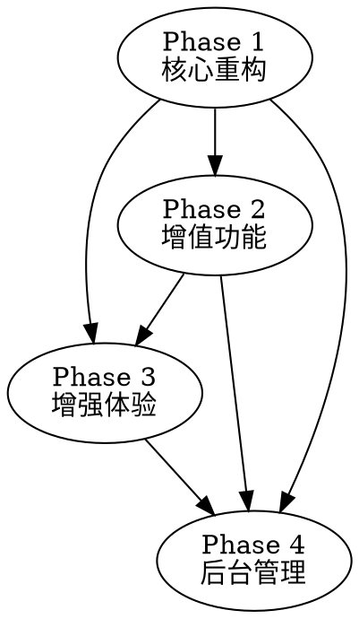

# 开发进度概述

## 开发阶段划分

| 阶段 | 名称 | 预计周期 | 主要目标 |
|------|------|---------|---------|
| Phase 1 | 核心重构 | 8 周 | 主项目架构、Python 后端、移动端核心 |
| Phase 2 | 增值功能 | 6 周 | Token/积分、问答悬赏、支付、邀请 |
| Phase 3 | 增强体验 | 6 周 | 学习搭子、学习匹配、共享笔记、游戏化 |
| Phase 4 | 后台管理 | 4 周 | 用户管理、内容审核、数据统计 |

## 阶段依赖关系

## 关键里程碑

| 里程碑 | 时间 | 交付物 |
|--------|------|--------|
| M1 - 核心功能完成 | Phase 1 结束 | 课程生成/播放、多智能体、协作 |
| M2 - 经济系统上线 | Phase 2 结束 | Token/积分、支付、问答 |
| M3 - 增强体验上线 | Phase 3 结束 | 学习搭子、游戏化、共享笔记 |
| M4 - 管理后台完成 | Phase 4 结束 | 管理后台、全功能上线 |

## 团队配置建议

| 角色 | 人数 | 负责范围 |
|------|------|---------|
| 前端工程师 | 2-3 | Next.js + Expo |
| 后端工程师 | 2 | FastAPI + PostgreSQL |
| AI 工程师 | 1 | LangGraph + LiteLLM |
| UI/UX 设计师 | 1 | 设计规范 |
| 测试工程师 | 1 | E2E 测试 |

## 验收标准总览

| 指标 | 目标值 |
|------|--------|
| 功能完整性 | 所有 P0 功能完成 |
| 性能指标 | Lighthouse > 90，API < 200ms |
| 测试覆盖率 | 单元 > 70%，E2E > 80% |
| 安全审计 | 无高危漏洞 |
| 用户验收 | Beta 测试满意度 > 80% |

## 详细进度文档

- [Phase 1: 核心重构](main-project-phase1.md)
- [Phase 2: 增值功能](core-features-phase2.md)
- [Phase 3: 增强体验](enhancement-phase3.md)
- [Phase 4: 后台管理](admin-phase4.md)